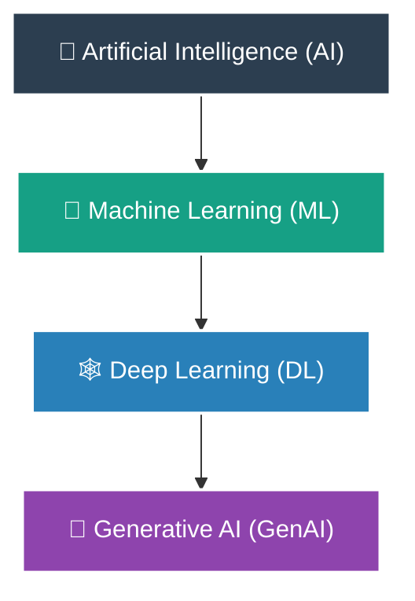

# 🧠 The Core Concepts of AI, ML, Deep Learning & Generative AI

If you are new to the world of artificial intelligence, the terminology can feel overwhelming. Let us break down the core concepts you need to know for the AWS Certified AI Practitioner exam.

---

## 1. 🪆 The Russian Doll of AI
Think of Artificial Intelligence, Machine Learning, Deep Learning, and Generative AI like a set of nesting Russian dolls. Each concept sits inside the other, representing a progression from general computer systems to highly specialized generative models.



*   **Artificial Intelligence (AI):** This is the largest, outermost doll. It represents any computer system designed to mimic human cognitive behavior, including making decisions, solving problems, recognizing speech, and understanding natural language.
    *   *Narrow AI vs. General AI:* AI is divided into **Narrow AI** (or Weak AI) and **General AI** (AGI or Strong AI).
    *   *Narrow AI Example:* An email spam filter or a chess-playing computer program. These systems are highly effective at their specific task but cannot write a poem, compile code, or drive a car.
    *   *General AI (AGI) Example:* A hypothetical, science-fiction assistant including Jarvis from Iron Man or HAL 9000, which possesses humanlike reasoning, adaptable planning, and general intelligence across all domains.
*   **Machine Learning (ML):** This doll sits inside AI. Instead of writing rigid, hard-coded rules using conditional if/else statements, we feed training datasets into statistical models. The model learns how to map inputs, known as features ($X$), to outputs, known as labels ($Y$), by adjusting its internal weights ($w$):
```math
f(X; w) \approx Y
```
    Under the hood, we optimize these weights using a mathematical framework called **Empirical Risk Minimization (ERM)**:
```math
\min_{w} \frac{1}{N} \sum_{i=1}^N L(f(x_i; w), y_i)
```
    where $N$ represents the number of training samples, $L$ is a loss function measuring the error between the model's prediction and the ground truth, and $w$ represents the parameter weights.
    *   *ML Parameter Optimization Example:* Imagine predicting house prices. Your features ($X$) are the size in square feet and the number of bedrooms. The label ($Y$) is the actual sale price. The weight ($w$) is the multiplier for each square foot. During training, the optimization algorithm adjusts this weight to make predictions as close as possible to the actual sale prices in your historical dataset, minimizing the loss function.
> [!NOTE]
> **Jargon Buster:** **Empirical Risk Minimization** is the process of training a model to make the fewest mistakes possible on the training dataset. It achieves this by iteratively adjusting its internal parameters using optimization algorithms, including gradient descent, to find the lowest possible value of the loss function.
*   **Deep Learning (DL):** This doll sits inside ML. It uses **Artificial Neural Networks (ANNs)** containing an input layer, an output layer, and three or more hidden layers. These layers automatically extract features from raw data, eliminating the need for manual feature engineering.
    *   *Hierarchical Feature Learning:* In deep learning, early hidden layers detect basic structures, while intermediate layers combine these to detect complex boundaries. The deepest layers combine these boundaries to recognize complete objects.
    *   *DL Hierarchical Feature Example:* In facial recognition systems, the input layer receives raw image pixels. The first hidden layer detects horizontal and vertical lines. The second hidden layer combines these lines to detect shapes, including circles representing eyes. The third hidden layer combines these shapes to recognize facial components, including noses and mouths. The final output layer recognizes the face of a specific individual.
*   **Generative AI (GenAI):** The smallest doll at the center of the hierarchy. While classical ML focus on discriminative modeling to estimate the conditional probability $P(Y \vert X)$ of a label given the inputs, Generative AI models the joint probability distribution $P(X, Y)$ or the marginal probability distribution $P(X)$ of a dataset.
    *   *GenAI Joint Probability Example:* In a pet photography application, a discriminative model calculates the conditional probability $P(\text{Cat} \vert \text{Image})$ to decide if an uploaded image is a cat or a dog. A Generative AI model learns the joint probability distribution of cat pixels $P(\text{Cat Image})$ to synthesize a brand new, realistic image of a cat that has never existed in the real world.

---

## 2. 📡 How AI Processes Different Modalities
How do models actually process the world? Let us look at the difference between simulating human outputs and emulating biological brain pathways:

*   **Simulation:** Today's models *simulate* human intelligence. They run statistical calculations over high-dimensional vector spaces to predict the next word or pixel. They do not understand meaning or experience consciousness; they compute mathematical probabilities.
    *   *Simulation Example:* A flight simulator program running on a standard gaming console. It behaves like an airplane, responding to steering inputs, but does not use real aviation engines or physical lift physics.
*   **Emulation:** This would be physically replicating the biological wiring and chemical synaptic reactions of a human brain. Today's AI does not do this; it relies on matrix multiplication running on silicon chips.
    *   *Emulation Example:* Running a Nintendo Entertainment System (NES) emulator on a modern PC. The emulator replicates the actual hardware registers and clock cycles of the original Ricoh 2A03 processor.

> [!TIP]
> **Modality Analogy:** Think of modalities like the raw materials that enter a factory. Depending on whether you receive wood (text), steel (images), liquid (audio), or wire (molecules), you need a completely different processing machine. Similarly, neural networks use customized architectures tailored to the shape of the input data.

Here is how different data types, or **modalities**, are processed by specific architectures:

1.  **Text Modality:** Raw text characters are broken down into sub-word units called tokens using algorithms, including Byte-Pair Encoding or WordPiece. These tokens are mapped to high-dimensional embedding vectors, placing words with similar semantic meanings close together in vector space. The embeddings are routed through **Transformers**, which use multi-head self-attention mechanisms to calculate the relationship between every word in a sequence.
    *   *Text Modality Example:* Processing the sentence "The bank river was beautiful." The tokenizer splits the text into tokens `["The", "bank", "river", "was", "beautiful"]`. The embedding algorithm maps the token "bank" close to "river" and "water" in high-dimensional vector space, rather than close to "money", because of the surrounding context. The Transformer self-attention block calculates attention weights between "bank" and "river" to capture this meaning.
2.  **Vision Modality:** Images are represented as multi-dimensional matrices of pixel values. Classical machine learning uses **Convolutional Neural Networks (CNNs)**, which slide small mathematical filters over the pixel grid to capture spatial patterns. Modern Generative AI uses **Diffusion Models**, which start with pure Gaussian noise and iteratively subtract noise over defined time steps to generate coherent images.
    *   *Vision Modality Example:* Generating an image of a coffee mug. The Diffusion model starts with a grid of random colored pixels resembling television static. Over a sequence of 50 steps, the model predicts and removes noise from the grid, progressively forming clean edges, shadows, and the final shape of the coffee mug.
3.  **Audio Modality:** Sound waves are continuous analog signals. We sample these waves at regular intervals and transform them into the frequency domain using a Short-Time Fourier Transform (STFT), producing a two-dimensional spectrogram representing frequency amplitude over time. These spectrograms are processed using recurrent neural networks or wave-synthesis models, including WaveNet, to map temporal relationships.
    *   *Audio Modality Example:* A voice assistant generating speech. The system takes a text input, converts it into a Mel-spectrogram representing the frequency curves of the spoken syllables, and routes this image to a WaveNet model. WaveNet processes the frequency curves to generate synthetic audio waveforms that sound like a human pronouncing the syllables.
4.  **Molecular Modality:** Biological data, including chemical compounds and proteins, is modeled as mathematical graphs. **Graph Neural Networks (GNNs)** treat individual atoms or amino acids as nodes and chemical bonds or physical interactions as edges. GNNs use message-passing algorithms to share state information between neighboring nodes.
    *   *Molecular Modality Example:* Designing a new drug candidate. The drug molecule is represented as a graph where carbon, oxygen, and nitrogen atoms are modeled as nodes, and their single or double covalent bonds are modeled as edges. The GNN runs message-passing iterations to predict if this specific atomic graph will bind to a bacterial target protein.

---

## 3. 🐍 Authoring Code: The Jupyter Notebook Ecosystem
To develop machine learning pipelines and interact with models, developers rely on the Jupyter ecosystem. It provides interactive, document-centric environments to build, run, and share code.

*   **Jupyter Notebook:** A web-based application for authoring documents that combine live, executable code, narrative text, LaTeX equations, and rich media visualizations. Before it was adopted as a community standard, the project was originally known as **IPython Notebook** (Interactive Python).
    *   *Jupyter Notebook Example:* A data scientist creates a `.ipynb` file to document an ML experiment, writing Python code blocks to load datasets, using Markdown blocks to explain the mathematical preprocessing steps, and rendering dynamic plots directly inside the document.
*   **Jupyter Lab:** The next-generation web-based user interface for Jupyter. It integrates notebooks, text editors, bash terminals, and file browsers in a highly flexible, multi-tab layout. Jupyter Lab is designed to replace the legacy **Jupyter Classic Notebook** interface.
    *   *Jupyter Lab Example:* A developer opens a SageMaker Studio session that runs a Jupyter Lab interface. The developer has a notebook open in one tab, a command line terminal open in another tab to monitor GPU utilization, and a text editor open in a third tab to tweak custom Python libraries.
*   **Jupyter Hub:** A multi-user server designed to spawn, manage, and scale individual Jupyter notebook instances for large organizations. It acts as an orchestrator for multiple instances of Jupyter Lab.
    *   *Jupyter Hub Example:* A corporate IT department deploys Jupyter Hub on an AWS Kubernetes cluster, allowing 100 data science team members to log in using Single Sign-On (SSO) and instantly spin up isolated, dedicated Jupyter Lab workspaces running on shared GPU compute servers.

> [!NOTE]
> **Notebook Compatibility Gotcha:** Many modern IDEs and web services, including Visual Studio Code (VS Code) and Google Colab, support notebook interfaces that are fully compatible with Jupyter files (`.ipynb`), even though they use their own underlying web renderers and backends rather than standard Jupyter Lab.

---

## 4. ⚡ Picking the Right Compute Instance on AWS
Deep learning requires massive computing power. Here is how to select the right EC2 instance size in the AWS console:

*   **Standard Compute Instances (CPU):** Central Processing Units (CPUs) are designed for low-latency serial execution of general tasks. They are best for classical machine learning models, including linear regression, decision trees, and K-Means clustering, that run on libraries including scikit-learn. These models run efficiently on basic instance families, including `ml.m5.large` or `ml.c5.xlarge`.
    *   *CPU Compute Example:* Training a simple linear regression model to predict customer churn based on a small spreadsheet of 1,000 customer rows. This task runs in less than two seconds on a standard dual-core `ml.m5.large` instance.
*   **Accelerated Compute Instances (GPU):** Graphics Processing Units (GPUs) contain thousands of small arithmetic cores designed for high-throughput parallel execution of matrix multiplications. GPU VRAM (video random access memory) acts as a high-speed sandbox that holds model parameters and intermediate activation states during training and inference.
    *   `ml.g4dn.xlarge` (NVIDIA T4 GPU, $16\text{ GB}$ VRAM): Cost-effective GPU instance designed for machine learning inference and light model fine-tuning. Includes Tensor Cores to accelerate half-precision matrix multiplication.
        *   *ml.g4dn Example:* Deploying a real-time object detection model to identify delivery trucks on a building security camera feed.
    *   `ml.g5.2xlarge` (NVIDIA A10G GPU, $24\text{ GB}$ VRAM): Highly popular GPU instance for medium-scale training jobs, complex real-time inference, and LLM fine-tuning.
        *   *ml.g5 Example:* Fine-tuning a 7-billion parameter language model on a company's internal customer service transcripts to adapt its tone.
    *   `ml.p4de.24xlarge` (8x NVIDIA A100 GPUs, $640\text{ GB}$ VRAM total): High-end instance cluster featuring NVLink high-speed GPU interconnects. Essential for training foundation models from scratch, running large-scale distributed training, and hosting extremely large models.
        *   *ml.p4de Example:* Training a multi-modal foundation model on billions of web documents and images across a cluster of instances for several weeks.

> [!WARNING]
> **SageMaker Canvas Cost Trap:** SageMaker Canvas charges a flat fee of **\$1.90 per hour** to keep your visual workspace running by provisioning an active compute instance in the background. Simply closing your browser tab does not turn off the instance. You must explicitly click the log out button located in the bottom-left corner of the interface to terminate the instance and stop the billing.
> *   *Canvas Cost Trap Example:* An analyst opens SageMaker Canvas, uploads a dataset, and builds a prediction model. At 5:00 PM, they close their browser tab, assuming the session ends. Because they did not click the log out button, the background compute instance runs all weekend for 64 hours, generating an unexpected charge of \$121.60 on the company's AWS invoice.

---

## 5. 📊 Feature Comparison: Classic ML vs. Generative AI

Here is a side-by-side comparison of the core characteristics of classical machine learning and generative artificial intelligence:

| Feature | Classical AI / ML | Generative AI |
| :--- | :--- | :--- |
| **Mathematical Goal** | Discriminative: Models the conditional probability $P(Y \vert X)$ to classify inputs or predict continuous numbers. | Generative: Models the joint probability $P(X, Y)$ or marginal probability $P(X)$ to create new data. |
| **Compute Profile** | Runs efficiently on low-cost CPUs or single GPUs. | Requires high-performance GPU clusters for training and running inference. |
| **Feature Extraction** | Requires manual data cleaning, normalization, and feature engineering. | Model automatically learns hierarchical features directly from raw inputs. |
| **AWS Services** | SageMaker Autopilot, SageMaker XGBoost, Amazon Lex. | Amazon Bedrock, Amazon Q, SageMaker JumpStart. |
| **Use Case** | Predicting credit card fraud based on transaction history. | Generating a customer service email response based on a complaint. |

### Architectural Deep Dive: Classical ML vs. Generative AI
1.  **Mathematical Optimization:** Classical ML optimization is focused on identifying decision boundaries that separate classes or minimize the distance between predictions and continuous targets. Generative AI optimization is focused on capturing the data distribution shape, enabling it to generate new points in that distribution.
    *   *Optimization Example:* A classical ML spam filter maps features to a single probability boundary where emails above $0.9$ are marked as spam. A Generative AI model optimization learns the grammar patterns of spam emails to generate a synthetic spam message template for training purposes.
2.  **Compute Infrastructure Scaling:** Classical ML models, including random forests, scale linearly with features and rows, and they are typically trained in a few minutes. Generative AI models, including LLMs, scale quadratically with token lengths due to self-attention calculations, requiring multi-node distributed training setups.
    *   *Compute Scaling Example:* Training a classical XGBoost regression model on a tabular housing dataset takes less than one minute on a CPU. Training a Llama foundation model requires a distributed cluster of GPU instances, with memory and training time scaling quadratically as the context window size increases.
3.  **Feature Representation Learning:** In classical ML, the data scientist must decide how to represent features, including using TF-IDF for text or extracting keypoints for images. In Generative AI, raw inputs are converted directly to high-dimensional embeddings, and the model learns representation patterns through self-supervised pre-training.
    *   *Representation Example:* For a movie review sentiment model, a classical ML pipeline requires a developer to transform text using one-hot encoding or TF-IDF vectors before training a random forest classifier. A Generative AI pipeline takes the raw text reviews, converts them to high-dimensional embedding vectors, and passes them to a pre-trained Transformer model that already understands the semantic relationships of the words.
