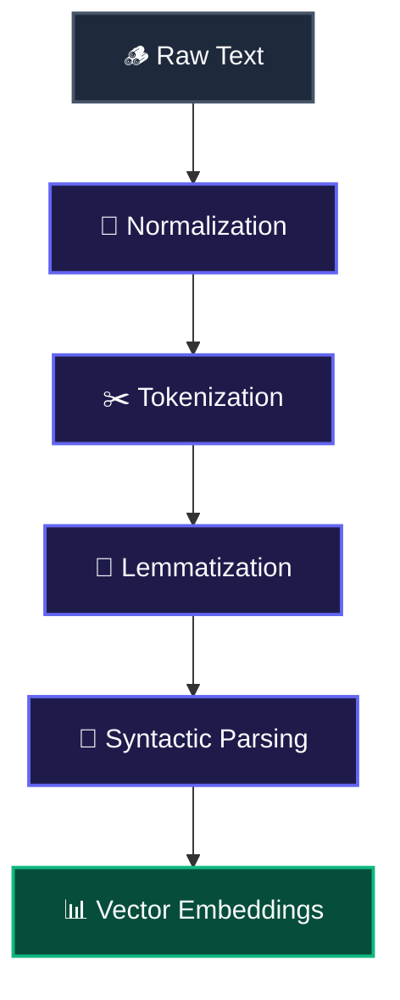

# 🪵 Building an NLP Pipeline: From Raw Text to Semantic Meaning

**Natural Language Processing (NLP)** is the science of helping computers read, write, and understand human language. Since computers only understand numbers, the core challenge of NLP is turning unstructured text strings into structured, fixed-size lists of numbers called **vector embeddings**.

---

## 1. ⚙️ Step-by-Step: The NLP Pipeline
Think of the NLP pipeline like an industrial timber mill. You feed in rough, irregular logs of raw text, strip off the bark, clean the wood, and slice it into standardized planks that are easy to build with.



### Phase 1: Pre-processing & Data Wrangling
Before feeding text to a model, we must clean it up:
*   **Lowercasing/Uppercasing:** Normalizing casing across the corpus. This prevents the model from treating capitalized and uncapitalized words as separate vocabulary tokens (e.g., treating `"Cat"` and `"cat"` as different entities).  <br /> 🔍 **Example:** Standardizing a user input query `"Buy Amazon Stocks"` to `"buy amazon stocks"` to ensure matching consistency.
*   **Normalization:** Converting characters to lowercase and stripping out accents or diacritics.  <br /> 🔍 **Example:** Transforming the raw string `"München, Café, COLD"` into its normalized form `"munchen, cafe, cold"` so that your downstream model does not treat words with different capitalizations or diacritics as distinct vocabulary items.
*   **Contraction Expansion:** Converting words, including converting `"don't"` to `"do not"`, to keep your grammar consistent.  <br /> 🔍 **Example:** Expanding the raw review `"I'm feeling great and they'll arrive soon"` into `"I am feeling great and they will arrive soon"` to ensure standardized syntactic structure.
*   **Sanitization:** Removing HTML tags, emojis, and non-ASCII characters from the text.  <br /> 🔍 **Example:** Cleaning a scraped web page snippet containing `"<p>Check out our site! 😊</p>"` to output `"Check out our site!"` so that formatting tags and icons do not distort word frequency calculations.
*   **Stop Word Removal:** Deleting common words, including `"the"`, `"and"`, and `"is"`, to shrink your vocabulary.  <br /> 🔍 **Example:** In a news categorization system, cleaning the sentence `"A volcanic eruption is happening"` down to the core keywords `["volcanic", "eruption", "happening"]` to eliminate words that do not add category-specific semantic values.
> [!WARNING]
> **Stop Word Gotcha:** Do not remove stop words if you are training sentiment analysis models or generative LLMs. Removing words, including `"not"` or `"no"`, completely flips the meaning of a sentence.  <br /> 🔍 **Example:** If a model removes stop words from `"I am not happy"`, the sentence is stripped down to `"I happy"`, causing a sentiment model to output a false-positive classification when it should be negative.
*   **Tokenization:** Breaking down a corpus of text into smaller structural units (tokens), which are then mapped to unique numerical IDs. This acts as the bridge between human language and mathematical arrays.  <br /> 🔍 **Example:** Segmenting the raw sentence `"I love NLP."` into the list of tokens `["I", "love", "NLP", "."]`, which are then mapped to their respective vocabulary IDs, such as `[42, 108, 995, 3]`.
> [!WARNING]
> **Tokenization Gotcha:** Tokenizer vocabulary mismatch and Out-of-Vocabulary (OOV) tokens. This is a bit of a headache, but here is the trick: if you train your model on one tokenizer (like SentencePiece) and run inference using a slightly different version or vocabulary, your inputs will map to completely different numerical IDs, producing total garbage. Likewise, if your tokenizer encounters words completely missing from its vocabulary, it may replace them with an `[UNK]` (unknown) token, wiping out key information.  <br /> 🔍 **Example:** The word `"Antigravity"` passing through a subword tokenizer (like WordPiece) might be split into `["Anti", "##g", "##rav", "##ity"]`. If the vocabulary is missing these pieces, it maps to `["[UNK]"]`, causing the model to lose the concept entirely.
*   **Stemming:** A crude, rule-based approach that chops off the ends of words. For example, `"connecting"`, `"connected"`, and `"connection"` all get hacked down to the stem `"connect"`. It is fast but can create non-dictionary words.  <br /> 🔍 **Example:** Running a Porter Stemmer over the word list `["computation", "computer", "computing"]` outputs `["comput", "comput", "comput"]`, stripping away the suffix endings and leaving the incomplete root word `"comput"`.
*   **Lemmatization:** A smart, linguistic approach that looks up words in a dictionary to find their base form, which is known as the **lemma**. For example, `"better"` maps to `"good"`, and `"running"` maps to `"run"`.  <br /> 🔍 **Example:** Analyzing the irregular verb `"was"` returns its dictionary base form `"be"`, and lemmatizing the plural form `"children"` returns the singular lemma `"child"`.

> [!TIP]
> **Pruning Analogy:** Think of Stemming like a landscaper roughly hacking branches off a tree with a chainsaw. It is fast, but messy. Lemmatization is like a botanist identifying the exact root structure of the plant and gently pruning it to its base form.

### Phase 2: Natural Language Understanding (NLU) & Syntax
Once the text is clean, we analyze how the words fit together:
*   **Part-of-Speech (POS) Tagging:** Labeling each token as a noun, verb, adjective, or other grammatical category.  <br /> 🔍 **Example:** Tagging the sentence `"Book the flight"` labels `"Book"` as a **VERB** and `"flight"` as a **NOUN**, whereas tagging `"He read a book"` labels `"book"` as a **NOUN**.
*   **Chunking:** Grouping words together into meaningful phrases, including noun phrases.  <br /> 🔍 **Example:** Grouping the sentence `"The smart developer wrote code"` to extract the phrase `"The smart developer"` as a single **Noun Phrase (NP)**.
*   **Dependency Parsing:** Drawing a graph of arrows that show how words grammaticaly rely on one another.  <br /> 🔍 **Example:** Parsing the sentence `"She loves coding"` creates a directed link labeled **nsubj** (nominal subject) pointing from the head verb `"loves"` to `"She"`, and a link labeled **dobj** (direct object) pointing from `"loves"` to `"coding"`.
*   **Constituency Parsing:** Breaking a sentence down into nested sub-phrases based on structure rules.  <br /> 🔍 **Example:** Decomposing `"The cat sat"` into a top-level Sentence (S) node, which branches into a Noun Phrase (NP = `"The cat"`) and a Verb Phrase (VP = `"sat"`).
> [!WARNING]
> **Parsing Gotcha:** Structural and syntactic ambiguity. Human language is messy and full of double meanings that can confuse dependency and constituency parsers, causing them to generate inaccurate parse trees.  <br /> 🔍 **Example:** In the sentence `"I saw the man with the telescope"`, an ambiguous parse can link `"with the telescope"` either to the verb `"saw"` (using the telescope to see) or to the noun `"man"` (the man was holding a telescope).

### Phase 3: Extracting Business Value
Now we can run downstream NLP tasks:
*   **Named Entity Recognition (NER):** Spotting and labeling key nouns, including identifying names of people, companies, locations, or Personally Identifiable Information (PII).  <br /> 🔍 **Example:** Scanning the sentence `"Steve Jobs founded Apple in Cupertino"` to extract `"Steve Jobs"` as a **PERSON**, `"Apple"` as an **ORGANIZATION**, and `"Cupertino"` as a **LOCATION**.
*   **N-grams:** Splitting text into contiguous groups of $n$ words to catch context, including $2$-grams or $3$-grams.  <br /> 🔍 **Example:** Processing the phrase `"deep learning model"` yields:
        *   *Unigrams ($1$-grams):* `["deep", "learning", "model"]`
        *   *Bigrams ($2$-grams):* `["deep learning", "learning model"]`
        *   *Trigrams ($3$-grams):* `["deep learning model"]`
*   **Sentiment Analysis:** Scanning text to classify the emotional tone, including labeling it Positive, Negative, Neutral, or Mixed.  <br /> 🔍 **Example:** Scanning a product review stating `"I received the package today. The box was damaged, but the actual product works perfectly!"` to output a overall **MIXED** sentiment rating.
*   **Targeted Sentiment:** Finding the sentiment toward specific features.  <br /> 🔍 **Example:** In the phrase "The screen is beautiful but the battery is bad," the model records positive sentiment for the entity "screen" and negative sentiment for the entity "battery."
*   **Information Retrieval & Extraction:** Querying a large text corpus and extracting key facts, structured data, or relationships.  <br /> 🔍 **Example:** Processing 5,000 PDF lease agreements to build a structured database containing fields like `{"landlord": "John Doe", "rent": "\$2,500/month", "lease_start": "2026-06-01"}`.
> [!WARNING]
> **Extraction Gotcha:** Structural layout noise. If documents contain complex tables, multi-column layouts, or poor-quality OCR, text extraction pipelines can read blocks in the wrong logical order, resulting in garbled or completely missed key facts.
*   **Topic Modeling:** Grouping large collections of documents into topics based on how often words appear together.  <br /> 🔍 **Example:** Processing 1,000 company support tickets to discover a cluster containing the words `["login", "password", "reset", "email"]` and mapping it to a "Password Reset" topic.

### Phase 4: Vector Embeddings & Vector Space
The ultimate goal of the preprocessing and syntactic analysis is often to convert unstructured text into numbers that a neural network can actually compute. This is where vector embeddings and vector spaces come in:
*   **Vector:** A mathematical representation of length and direction, represented as a one-dimensional array of numbers:
```math
\vec{v} = [v_1, v_2, \dots, v_d]^T \in \mathbb{R}^d
```
*   **Embeddings:** High-dimensional vector representations of text where semantic meanings are mapped into a continuous, multi-dimensional **Vector Space**. Words or phrases with similar semantic meaning will have vectors that are clustered closer together in this space.
*   **Closeness Metrics (Cosine Similarity):** To measure semantic similarity between two text snippets, models compute the cosine of the angle between their respective vectors. A cosine similarity of $1$ means the vectors point in the exact same direction (highest similarity), whereas $0$ indicates orthogonality (no similarity):
```math
\text{Cosine Similarity}(\vec{u}, \vec{v}) = \frac{\vec{u} \cdot \vec{v}}{\|\vec{u}\| \|\vec{v}\|} = \frac{\sum_{i=1}^d u_i v_i}{\sqrt{\sum_{i=1}^d u_i^2} \sqrt{\sum_{i=1}^d v_i^2}}
```
*   **External Memory & Multi-Modal Alignment:** Embeddings can act as "external memory" for ML models, representing concepts in a model-agnostic mathematical space. They can be shared across models to enable multi-modal coordination (e.g., mapping a text embedding of `"dog"` to a vision model's image embedding of a dog in the same vector space).  <br /> 🔍 **Example:** Mapping the words `"king"` and `"queen"` to vectors in a $768$-dimensional space. Because they represent related concepts of royalty, their cosine similarity is high (e.g., $0.85$). In contrast, the similarity between `"king"` and `"banana"` would be close to $0$ (e.g., $0.05$).
> [!WARNING]
> **Embedding Gotcha:** The Curse of Dimensionality. This is a bit of a headache, but here is the trick: while higher-dimensional embeddings (e.g., $1536$ or $3072$ dimensions) capture finer semantic nuances, they also consume dramatically more GPU memory and storage, and computing similarity across millions of vectors becomes computationally sluggish. To mitigate this, developers use Approximate Nearest Neighbor (ANN) index search algorithms like Hierarchical Navigable Small World (HNSW).

---

## 2. 🛜 Using AWS Managed NLP & Speech Services
AWS offers serverless APIs that let you run NLP, speech, text extraction, and conversational workflows without training or deploying models yourself:

*   **Amazon Comprehend:** A serverless NLP engine that extracts insights and relationships from unstructured text.
    *   *Billing Unit:* Billed in units of **100 characters** (minimum charge is 1 unit per request).
    *   *Core APIs:* `DetectDominantLanguage`, `DetectEntities`, `DetectKeyPhrases`, `DetectPiiEntities`, `DetectSentiment`.
    *   *Comprehend Flywheel:* Automates the continuous training, evaluation, and versioning of custom classification or entity detection models by feeding new labeled datasets from S3.  <br /> 🔍 **Example:** Invoking the `DetectPiiEntities` API on a customer email containing `"Call Jane at 555-0199"` to detect `"Jane"` as a `NAME` entity and `"555-0199"` as a `PHONE_NUMBER` entity, allowing you to redact or mask this sensitive data automatically before storage.
> [!WARNING]
> **Comprehend Gotcha:** Token/Character limits. Comprehend APIs fail if individual document text sizes exceed specific limits (e.g., $1\text{ MB}$ for asynchronous batch jobs or $100\text{ KB}$ for real-time operations). You must chunk your text before passing it to the API.

*   **Amazon Kendra:** An enterprise search engine that uses ML and semantic query understanding to retrieve answers from unstructured documents.
    *   *Connectors:* Automatically index folders and metadata in Amazon S3, Salesforce, SharePoint, ServiceNow, Confluence, and relational databases.
    *   *Cost Trap:* Default API deployments provision the **Enterprise Edition (\$1.40/hour)**. Make sure to select the Developer Edition for development environments to save money.  <br /> 🔍 **Example:** An employee typing the question `"What is the standard maternity leave duration?"` in the company portal. Kendra searches indexed PDF policy manuals in S3 and returns the exact paragraph detailing the 12-week policy duration, rather than returning a list of links matching keyword strings.

*   **Amazon Translate:** Real-time and batch neural machine translation service.
    *   *Terminology Files:* You can upload custom CSV or TMX files to S3 to stop the model from translating brand names, trademarks, or highly specialized jargon literally.  <br /> 🔍 **Example:** Uploading a custom dictionary file mapping the product brand name `"Paperback"` to its exact French translation `"Paperback"` to prevent the service from literally translating it into French as `"Livre de poche"` on your global e-commerce listings.

*   **Amazon Lex:** Helps you build conversational interfaces and chatbots using voice and text, powered by Automatic Speech Recognition (ASR) and Natural Language Understanding (NLU).
    *   *Core Concepts:*
        *   **Utterances:** The spoken or typed phrases a user inputs to interact with the bot (e.g., `"I want to book a hotel room"`).
        *   **Intents:** The goal or action the user wants to achieve (e.g., `BookHotel`).
        *   **Slots:** The variables or parameters the bot must gather to fulfill the intent (e.g., `CheckInDate`, `Location`, `RoomType`).
        *   **Prompts:** Questions the bot asks to prompt the user for slot values (e.g., `"What day will you check in?"`).
        *   **Fulfillment:** The action taken once all slots are gathered, which is usually handled by an **AWS Lambda** function.  <br /> 🔍 **Example:** A customer ordering a pizza typing `"I'd like a large pepperoni pizza"`. Lex identifies the `OrderPizza` intent, extracts `large` (size slot) and `pepperoni` (topping slot), prompts the user for delivery location, and invokes a Lambda function to record the order once complete.
> [!WARNING]
> **Lex Gotcha:** Overlapping Utterances. This is a bit of a headache, but here is the trick: if you configure similar utterances for different intents (e.g., `"I need help"` mapping to both `TechnicalSupport` and `BillingHelp`), the NLU parser will fail to resolve the intent accurately, causing the bot to trigger the wrong conversation path.

*   **Amazon Polly:** A Text-to-Speech (TTS) service that synthesizes lifelike speech from written text.
    *   *Engines:* Standard (basic synthesis), Neural (natural-sounding, contextual prosody), and Long-form (designed for articles/news narration).
    *   *Features:* Pronunciation Lexicons (modify how specific words/acronyms are spoken) and **SSML (Speech Synthesis Markup Language)** tags (XML-like tags to add pauses, whispers, breathing, or customize news caster styles).  <br /> 🔍 **Example:** A podcast app converting a blog post to audio using Polly's Neural engine, adding an SSML pause `<break time="2s"/>` between sections to make the transition sound natural.

*   **Amazon Transcribe:** A Speech-to-Text (STT) service that converts audio inputs into clean text transcripts.
    *   *Capabilities:* Speaker Diarization (identifying who spoke when), Custom Vocabularies (handling domain-specific terms or jargon), and real-time streaming transcripts.  <br /> 🔍 **Example:** Automating customer call summaries by running Transcribe with speaker diarization on a call recording, which splits the transcript between `Speaker 0` (customer) and `Speaker 1` (support agent).
> [!WARNING]
> **Transcribe Gotcha:** Background noise and accent mismatch. Low-quality audio inputs with heavy ambient noise or non-standard accents dramatically degrade transcription accuracy. You must pre-process audio to filter noise or utilize custom vocabulary models to aid the parser.

*   **Amazon Textract:** An advanced document text and data extraction service (OCR-plus) that extracts tables, forms, and structured text from documents.
    *   *Capabilities:* Table extraction (rows/columns), Form extraction (key-value pairs), Layout detection, and the Queries API (asking questions in plain English, e.g., `"What is the tax amount?"`).  <br /> 🔍 **Example:** Processing scanned invoice images. Textract extracts key-value pairs (e.g., mapping `"Invoice Date"` to its value) and extracts tables of line items, allowing automated data entry into accounting systems.
> [!WARNING]
> **Textract Gotcha:** Poor OCR on handwriting. While Textract excels at printed text and tables, highly cursive handwriting or low-contrast scans will result in confidence scores dropping off a cliff. For high-stakes workflows, you must route low-confidence results to a Human-in-the-loop validation flow like Amazon A2I.

---

## 3. 📊 Tool Selection: Stemming vs. Lemmatization

| Metric | Stemming | Lemmatization |
| :--- | :--- | :--- |
| **Mechanism** | Simple rule-based chopping. | Dictionary and morphology lookup. |
| **Output Quality** | Can produce non-words, including `"arguing"` mapping to `"argu"`. | Always returns a valid dictionary base word, including `"arguing"` mapping to `"argue"`. |
| **Processing Speed** | Extremely fast with low memory usage. | Slower; requires parsing grammar and dictionary lookups. |
| **Primary Use Case** | Building fast search indexes. | Preparing inputs for translation, conversational bots, and LLMs. |
