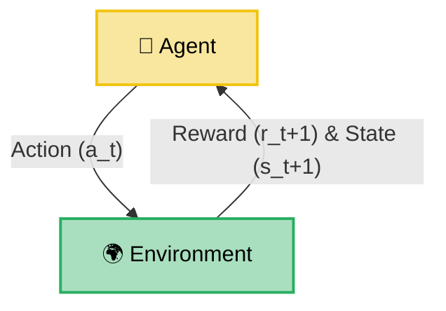

# 🤖 Foundational Paradigms & Styles of Machine Learning

Machine learning models learn patterns from data by updating their internal parameters. Before diving into specific algorithms, we must understand the core learning paradigms, statistical inference styles, and training techniques that govern how machines acquire knowledge.

---

## 1. 🚸 Supervised, Unsupervised, and Reinforcement Learning

The three primary machine learning paradigms differ fundamentally in the nature of their data inputs and feedback loops:

*   **Supervised Learning:** The model is trained on **labeled data** (inputs $X$ paired with correct output labels $Y$).
    *   **Mathematical Goal:** Learn a mapping function $f(X) = Y$ to make precise predictions on unseen data by minimizing a loss function $L(Y, \hat{Y})$.
    *   *Analogy:* Studying for a test using flashcards that have the question on the front and the answer on the back. The model looks at features ($X$), makes a guess ($\hat{Y}$), checks the true answer ($Y$), and adjusts itself to minimize the error.
    *   *Supervised Example:* Training a classifier on historical customer records to predict customer churn ($Y \in \{0, 1\}$).
> [!WARNING]
> **Supervised Gotcha:** Underfitting vs. Overfitting. A model with high bias (underfitting) fails to capture the underlying pattern in the training data, while a model with high variance (overfitting) memorizes the training noise, failing to generalize to new, unseen test data.
*   **Unsupervised Learning:** The model is trained on **unlabeled data** to find hidden structures, patterns, or groupings within the features $X$.
    *   **Mathematical Goal:** Identify underlying probability distributions or maximize cluster separation without an explicit target variable $Y$.
    *   *Analogy:* Being handed a giant pile of mixed coins and sorting them into groups by size and color without knowing what they are. You group them purely by similarity.
    *   *Unsupervised Example:* Segmenting a customer database into distinct purchasing groups based on transactional features.
> [!WARNING]
> **Unsupervised Gotcha:** Distance metric sensitivity. Most clustering algorithms rely on distance calculations (e.g., Euclidean distance). If you fail to scale your features (e.g., mixing age in years with income in dollars), features with larger raw ranges will completely dominate the clusters, rendering the output useless.
*   **Reinforcement Learning:** An **agent** interacts with an **environment** by taking **actions** ($a_t$) and learning via trial-and-error feedback loops of **rewards** ($r_t$) and **penalties**.
    *   **Mathematical Goal:** Learn an optimal policy $\pi(s)$ that maps states to actions to maximize the expected cumulative discounted reward over time.
    *   *Analogy:* Training a dog. There is no historical dataset. Instead, the dog performs actions, and you give treats (rewards) for good behavior or ignore/time-out (penalties) for bad behavior.
    *   *Reinforcement Example:* Directing an autonomous warehouse robot to navigate a floor grid.
> [!WARNING]
> **Reinforcement Gotcha:** Reward Hacking. If the reward function is not designed carefully, the agent will find loopholes to maximize rewards without actually solving the intended problem (e.g., a game-playing agent stalling infinitely to collect low-risk points rather than completing the level).

---

## 2. 🧬 Hybrid Learning Problems

In practice, data is rarely clean, cheap, or fully labeled. Hybrid approaches bridge the gaps:

*   **Semi-supervised Learning:** Combines a small amount of labeled data with a large amount of unlabeled data to improve training efficiency and reduce manual labeling costs.
    *   *Semi-supervised Example:* A photo tagging app has 1 million user photos but only 10,000 are labeled with person tags. It uses the 10,000 labeled photos to find similar clusters in the 990,000 unlabeled photos, labeling them semi-automatically.
> [!WARNING]
> **Semi-supervised Gotcha:** Label Propagation Error. If the labeled and unlabeled data distributions do not share clear boundary clusters, false labels will propagate across classes, corrupting the model.
*   **Self-supervised Learning:** The model automatically generates its own labels from the input data (often by masking parts of the input and training the model to predict the missing pieces).
    *   *Self-supervised Example:* Pre-training a language model by masking $15\%$ of the words in a corpus (e.g., `"The [MASK] chased the mouse"`) and predicting `"cat"`. This is how foundation models (FMs) learn language syntax.
> [!WARNING]
> **Self-supervised Gotcha:** Trivial representations. If the pretext task is too easy, the model will learn trivial shortcuts (like copying adjacent pixels or characters) rather than learning deep semantic relationships.
*   **Multi-instance Learning:** Training examples are grouped into "bags", and labels are applied to the bags rather than individual instances.
    *   *Multi-instance Example:* Scanning a medical slide of cells (a bag). The slide is labeled `"malignant"` if at least one cell on the slide is cancerous. The individual cells themselves are unlabeled.
> [!NOTE]
> **Multi-instance Trick:** This is a bit of a headache, but here is the trick: you do not need labels for individual instances, only the bags. If a bag is positive, at least one instance inside is positive. If a bag is negative, *every* instance inside is guaranteed to be negative.
> [!WARNING]
> **Multi-instance Gotcha:** Noise dilution. If a positive bag contains $10,000$ instances and only $1$ is positive, the signal gets heavily diluted, making it incredibly difficult for the model to isolate the active instance.

---

## 3. 🔮 Statistical Inference Types

Inference defines how we reason about relationships and draw conclusions from data:

*   **Inductive Inference:** Drawing generalized rules from specific observations.
    *   *Inductive Example:* Training a model on $100,000$ historical housing sales to estimate price functions based on square footage, then using that general function to estimate the price of any new house.
> [!WARNING]
> **Inductive Gotcha:** Induction Bias. Inductive models assume the future behaves like the past. If market conditions shift abruptly, the generalized rules fail completely.
*   **Deductive Inference:** Applying general rules or premises to determine specific logical outcomes.
    *   *Deductive Example:* A rule-based expert system that asserts `"All humans are mortal"` and `"Socrates is human"`, and logically deduces `"Socrates is mortal"`.
> [!WARNING]
> **Deductive Gotcha:** Premise Dependency. If the initial general rules or premises are flawed, every deduction derived from them will be logically valid but factually incorrect.
*   **Transductive Inference:** Predicting specific outcomes for a specific target test set directly from training instances, without forming a generalized model first.
    *   *Transductive Example:* Graph-based semi-supervised learning where you propagate label values from a small set of labeled nodes directly to a set of unlabeled nodes on a fixed social network graph.
> [!NOTE]
> **Transductive Trick:** This is a bit of a headache, but here is the trick: transduction does not build a general function $f(X)$. Instead, it solves for the unlabeled test data directly. If you get a new test instance tomorrow, you have to rerun the entire algorithm from scratch.

---

## 4. 🛠️ Learning Techniques & Ensembles

How models are trained and combined determines their robustness and adaptation speed:

*   **Multitask Learning:** Training a single model to perform multiple related tasks simultaneously, sharing early representation layers.
    *   *Multitask Example:* A self-driving vehicle perception model that simultaneously predicts lane lines (regression), detects pedestrians (object detection), and reads speed limit signs (classification) from a single camera feed.
> [!NOTE]
> **Multitask Trick:** This is a bit of a headache, but here is the trick: if the tasks share layers but have conflicting gradients, updating weights to improve one task will actively destroy performance on the other. This is known as **Negative Transfer**.
*   **Active Learning:** The model dynamically queries a human annotator (oracle) to label specific data points that lie close to its decision boundary to maximize training efficiency.
    *   *Active Learning Example:* A document classification model scanning millions of emails. It selects only the 100 most ambiguous emails (where prediction probability is close to $0.5$) and requests labels from a human expert, ignoring the highly confident emails.
> [!WARNING]
> **Active Learning Gotcha:** Selection bias. If your active learning query strategy gets stuck in a particular region of the feature space, it will fail to sample other critical regions, leaving the model blind to entire sub-distributions.
*   **Online Learning:** Continuously updating the model's weights in real-time as new data streams in, rather than training in batches on a static dataset.
    *   *Online Learning Example:* A search engine ranking algorithm adjusting its weights dynamically based on live click-through logs of active web users.
> [!WARNING]
> **Online Learning Gotcha:** Catastrophic forgetting. If the incoming data stream suddenly shifts (e.g., during a holiday shopping rush), the model can overwrite its parameters, forgetting how to handle normal baseline traffic.
*   **Transfer Learning:** Taking a model pre-trained on a generic, large dataset and using its parameters as a starting point to train on a smaller, domain-specific task.
    *   *Transfer Learning Example:* Fine-tuning a ResNet model pre-trained on 1 million ImageNet images to classify rare skin lesions using only 500 clinical photos.
> [!WARNING]
> **Transfer Learning Gotcha:** Feature mismatch. If the source task distribution is too different from the target task (e.g., using a model trained on text classification to initialize an image segmentation model), transfer learning provides no benefit.
*   **Ensemble Methods:** Combining predictions of multiple models to produce a single, more robust output.
    *   **Bagging (Bootstrap Aggregating):** Training multiple models in parallel on random subsets of the data (sampled with replacement) and averaging their predictions (or voting).
        *   *Bagging Example:* A Random Forest classifier composed of 100 decision trees, each trained on a bootstrap sample of user churn data.
        *   *Gotcha:* Bagging primarily reduces *variance*, not *bias*. If your base models are too simple (underfitting), bagging will not make them perform better.
    *   **Boosting:** Training models sequentially, where each new model is trained to focus on and correct the errors made by the previous models.
        *   *Boosting Example:* An AdaBoost or XGBoost regressor where each subsequent tree fits the residual errors of the prior ensemble.
        *   *Gotcha:* Boosting reduces both bias and variance but is highly sensitive to noisy outliers or mislabeled training points.
    *   **Stacking:** Training multiple different model architectures in parallel, and combining their outputs using another meta-learner model.
        *   *Stacking Example:* Passing predictions from an SVM and a Random Forest into a final Logistic Regression model to make the final classification.
        *   *Gotcha:* Stacking can easily lead to data leakage if predictions are generated on the same training set without cross-validation, and it makes deployment pipelines a nightmare to maintain.

---

## 5. 🔄 Loops and Optimization Mechanics

How do these systems actually learn? They run in continuous feedback loops:



*   **Supervised Feedback Loop:** The model uses features ($X$) to predict a target ($\hat{Y}$). The **Loss Function** measures the error between the prediction and the ground truth. An **Optimizer** calculates gradients and updates parameters to minimize that loss.
*   **Unsupervised Clustering Loop:** Algorithms, including K-Means, place cluster centers (centroids) in vector space. They assign data points to the closest centroid based on distance, and then recalculate the centroid positions. They repeat this loop until the centroids stop moving.
*   **Reinforcement Learning Loop:** The **Agent** looks at the current **State** ($s_t$) of the **Environment**. It chooses an **Action** ($a_t$) based on its **Policy** ($\pi$). The environment returns a **Reward** ($r_{t+1}$) and transitions to the next state ($s_{t+1}$). The goal is to maximize the expected discounted return over time:
```math
G_t = \sum_{k=0}^{\infty} \gamma^k r_{t+k+1}
```

> [!NOTE]
> **Jargon Buster:** **Discount Factor ($\gamma$)** is a value between $0$ and $1$ that determines how much the model values immediate rewards versus long-term rewards. If it is close to $0$, the model is short-sighted; if it is close to $1$, it cares about long-term payoffs.

---

## 6. 📂 Setting Up Datasets on AWS

When training models on AWS, you must configure your data input channels correctly:

*   **SageMaker Training Jobs:** Require you to point your estimator to S3 data channels, including Train, Validation, and Test. Once training completes, SageMaker packages the parameters into a `model.tar.gz` archive in S3.
*   **SageMaker Ground Truth:** A managed service for labeling raw datasets.
    *   *Input Format:* Uses a JSON Lines (`.jsonl`) manifest file. Each line must be a JSON object with a `"source"` (for raw text) or a `"source-ref"` (pointing to an image in S3).
    *   *Size Limits:* Individual JSON lines must not exceed **100,000 characters**, and no single attribute can be larger than **20,000 characters**.
    *   *CORS Rule:* The S3 bucket holding your files must have Cross-Origin Resource Sharing (CORS) enabled. If you do not set this up, web browsers will block the labeling team from viewing your images.

---

## 7. 📊 Paradigm Comparison Matrix

| Attribute | Supervised Learning | Unsupervised Learning | Reinforcement Learning |
| :--- | :--- | :--- | :--- |
| **Data Format** | Labeled: $(X, Y)$ pairs. | Unlabeled: Features $X$ only. | No static dataset; learns via active environment feedback. |
| **Mathematical Goal** | Minimize prediction error: $L(Y, f(X))$. | Maximize cluster separation. | Maximize expected cumulative reward: $\mathbb{E}[\sum \gamma^t r_t]$. |
| **AWS Services** | SageMaker XGBoost, SageMaker Linear Learner. | SageMaker K-Means, SageMaker PCA. | AWS DeepRacer. |
| **Primary Use Case** | Predicting customer churn (Yes/No). | Segmenting customers into $5$ buying groups. | Directing an autonomous robot to navigate a warehouse floor. |
