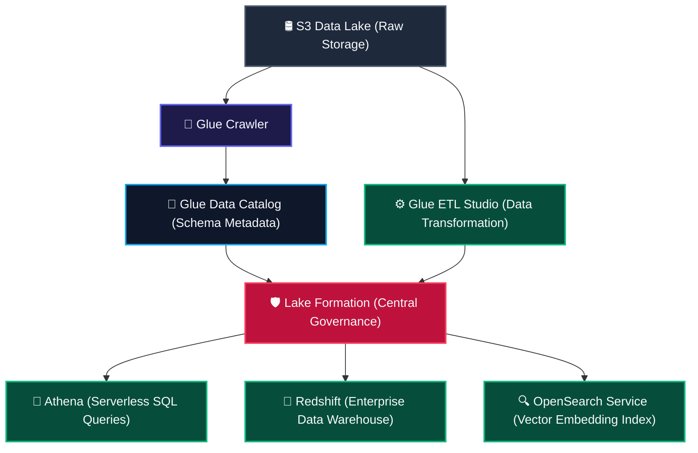

# 🛢️ Data Lakes, ETL, and Queries: Powering Your ML Pipelines

To train machine learning models, you need a place to store data, a way to clean it, and tools to search it. Let us look at how AWS services work together to build clean, high-performance data pipelines.

---

## 1. 🗄️ End-to-End ML Data Pipeline Architecture

To deploy high-performing machine learning systems on AWS, you must establish an integrated, secure, and performant data architecture. Here is how AWS data ingestion, query, and catalog services coordinate:



*   **Raw Storage (Amazon S3 Data Lake):** S3 serves as the central data repository. It stores raw, unstructured data, including text files, CSV logs, system metrics, image datasets, and audio transcripts.
*   **Metadata Discovery (AWS Glue Crawlers):** Automatically scan S3 folders, inspect file schemas, detect file formats, and write structural metadata into the Glue Data Catalog.
*   **Schema Catalog (AWS Glue Data Catalog):** A central Hive-compatible metadata directory containing database schemas, partition structures, and data formats, allowing query engines to understand S3 files.
*   **Data Governance (AWS Lake Formation):** Centralizes data lake setup and defines strict, fine-grained access control policies (row-level and column-level filters) on data catalog tables.
*   **Transformation Pipeline (AWS Glue Studio ETL):** Visual drag-and-drop developer interface for building, running, and monitoring Spark or Ray ETL jobs to clean, join, and format raw datasets. You can also prepare data serverlessly without code using **AWS Glue DataBrew**.
*   **Serverless Query (Amazon Athena):** Executes ad-hoc SQL queries directly on unstructured S3 files using serverless Presto and Trino query engines, without needing data loading.
*   **Enterprise Warehouse (Amazon Redshift):** A high-performance columnar data warehouse designed to analyze petabyte-scale, highly structured corporate tables.
*   **Semantic Vector Index (Amazon OpenSearch Service):** Indexes text files and high-dimensional machine learning vector embeddings to enable full-text, log analytical, and semantic search workloads.

---

## 2. ⚙️ AWS Glue: The Pipeline Filtration Engine

AWS Glue is a fully managed, serverless data integration service that extracts, transforms, and loads data for analytics and machine learning:

*   **AWS Glue Studio (Visual ETL):** A visual drag-and-drop developer interface for building, running, and monitoring ETL jobs using structural blocks called nodes:
    *   *Source Nodes:* The input location where data is pulled from, including Amazon S3, Amazon RDS, Amazon Aurora, and external JDBC-compatible databases.
    *   *Transform Nodes:* The data manipulation operations, including joining tables, filtering rows, dropping null values, splitting columns, and custom SQL transformations.
    *   *Target Nodes:* The output destination where data is written, including S3, Amazon Redshift, and Snowflake.
    *   *Version Control:* Visual jobs integrate directly with version control repositories, including AWS CodeCommit, GitHub, GitLab, and Bitbucket.  <br /> 🔍 **Example:** A data engineer builds a pipeline by dragging a Source Node reading raw JSON logs from S3, attaching a Transform Node that joins user profiles with transactions and drops null records, and pointing to a Target Node that writes Apache Parquet files to a production S3 bucket. The entire visual pipeline design is pushed automatically to a GitHub repository for version control.
*   **AWS Glue Jobs & Backend Engines:** AWS Glue runs data integration scripts using three distinct compute backends:
    1.  *Python Shell:* For running lightweight, single-node Python scripts that do not require massive distributed processing.
    2.  *Apache Spark:* For running heavy, distributed data transformation workloads across a cluster of serverless nodes.
    3.  *Ray (Preview):* A modern, open-source distributed compute framework designed for scaling Python libraries, serving as a Python-centric alternative to Spark.
> [!NOTE]
> **JVM-less Ray Trick:** This is a bit of a headache, but here is the trick: while Spark runs on a heavy JVM (Java Virtual Machine) backend which adds significant startup overhead and makes integrating native C++ scientific Python libraries (like NumPy, Pandas, or PyTorch) a complex packaging nightmare, Ray runs directly on a lightweight C++ engine designed specifically for dynamic, distributed Python script execution. It lets you scale arbitrary Python functions with zero JVM overhead.
    *   *DPU Billing:* Spark and Ray jobs are charged per Data Processing Unit (DPU) hour. A standard Spark job allocates a minimum of $D_{\text{min}} = 10$ DPUs (or $D_{\text{stream}} = 2$ DPUs for Spark streaming jobs), while a Ray job allocates a minimum of $D_{\text{ray}} = 6$ DPUs. Python Shell jobs use fractional DPUs (specifically, $D_{\text{shell}} = 0.0625$ DPUs).  <br /> 🔍 **Example:** An engineer writes a memory-intensive deduplication job to clean 10 billion records. They select the Apache Spark engine and configure a cluster allocating $20$ DPUs to scale the workload horizontally. For a simple schema check, they write a Python Shell script that runs on a single host using $0.0625$ DPUs to save compute cost.
*   **AWS Glue Data Catalog:** A centralized metadata repository that is fully compatible with Apache Hive metastores. It stores schemas, table definitions, and partition paths.
    *   *Table Formats:* Supports standard Glue tables, Apache Iceberg, Delta Lake, and Apache Hudi.  <br /> 🔍 **Example:** A transactional e-commerce dataset is registered in the Data Catalog using the Apache Iceberg table format. This configuration allows analytical tools to run ACID (Atomicity, Consistency, Isolation, Durability) transaction operations and time-travel queries directly on the underlying files in S3.
*   **AWS Glue Crawler:** A background process that connects to data stores, parses files, infers schemas, and writes tables in the Glue Data Catalog:
    *   *Data Sources:* Automatically scans S3, JDBC-compatible databases (including Amazon RDS, PostgreSQL, and MySQL), Amazon DynamoDB, and MongoDB.  <br /> 🔍 **Example:** A crawler runs nightly against an Amazon RDS PostgreSQL database. The crawler connects via JDBC, scans new columns added by developers during the day, infers the data types, and updates the table schema in the Glue Data Catalog without manual intervention.
> [!WARNING]
> **Crawler Schema Drift Gotcha:** When underlying S3 data schemas change (e.g., columns are added, removed, or changed), you must configure how the Crawler handles the schema drift in the catalog:
> 1. *Update the table definition (Default):* Automatically appends new columns and updates column data types.
> 2. *Add new columns only:* Appends new columns but leaves old, deleted columns intact in the metadata.
> 3. *Ignore the change:* Leaves the table definition static, which can cause downstream query engines to crash due to schema mismatches.
*   **AWS Glue Data Quality:** Measures, monitors, and validates data health:
    *   *DQDL (Data Quality Definition Language):* A language for writing validation rules, built on the open-source Deequ framework on Apache Spark.  <br /> 🔍 **Example:** A data engineer writes a DQDL rule: `RowCount > 500` and `IsComplete "customer_email"` to validate incoming CRM files. If a file arrives with blank email rows, the quality check fails, notifying the operations team and halting the downstream training pipeline.
*   **AWS Glue DataBrew:** A visual, drag-and-drop data preparation tool:
    *   *No-Code Prep:* Provides over 250 pre-built transformations to clean, enrich, and normalize datasets without writing code.  <br /> 🔍 **Example:** An analyst cleans physical address records by dragging and dropping DataBrew transformations to split a single address column into street, city, and state columns, lowercase all emails, and redact zip codes, creating a reusable data cleaning recipe.
    *   *Recipe Execution:* Once a visual recipe is finalized in DataBrew, you run it serverlessly in production by exporting it as a standard, scheduled AWS Glue ETL Job.

---

## 3. 🛡️ Data Lakes & AWS Lake Formation: Centralized Security Gatekeeper

*   **Data Lake:** A centralized repository designed to store vast quantities of raw structured, semi-structured, and unstructured data, using Amazon S3 as the core storage layer.
*   **AWS Lake Formation:** A service that simplifies data lake setup, defines data access policies, and provides centralized governance:
    *   *Fine-grained Access Control:* Enforces row-level, column-level, and cell-level permissions on data catalog assets.
    *   *Security Model:* Augments standard IAM policies with a database-style Grant/Revoke permission model.  <br /> 🔍 **Example:** A financial firm stores transaction logs in S3. Using Lake Formation, the security administrator runs a command granting the auditing team select access to the table, but applies a column-level filter that hides credit card numbers, and a row-level filter that only displays transactions originating within the auditor's home country.

---

## 4. 🚰 Amazon Athena: Serverless SQL on S3 Files

Amazon Athena is an interactive, serverless query service designed to analyze S3 data using standard SQL:

*   **Query Engine:** Athena executes SQL queries using Trino (a fork of Apache Presto).
*   **Workgroups:** Used to separate query environments, set query execution limits (for example, daily scan limits to control costs), and organize team members.
*   **Query Output S3 Bucket:** Athena is stateless; it automatically writes all query results as CSV files to a designated S3 output bucket.
*   **SQL Subsets:**
    *   *DDL (Data Definition Language):* SQL statements including `CREATE TABLE`, `ALTER TABLE`, and `DROP TABLE` to define metadata structures in the Glue Data Catalog.
    *   *DML (Data Manipulation Language):* SQL statements including `INSERT`, `UPDATE`, and `DELETE` to manipulate records (supported on transactional formats like Iceberg).
    *   *DQL (Data Query Language):* SQL statements including `SELECT` to query data.

### Athena Query Examples:
```sql
-- DDL Example: Create metadata mapping to S3 Parquet files
CREATE EXTERNAL TABLE IF NOT EXISTS marketing_db.campaign_logs (
    campaign_id STRING,
    clicks INT,
    spend DOUBLE,
    event_date STRING
)
ROW FORMAT SERDE 'org.apache.hadoop.hive.ql.io.parquet.serde.ParquetHiveSerDe'
STORED AS INPUTFORMAT 'org.apache.hadoop.hive.ql.io.parquet.MapredParquetInputFormat'
OUTPUTFORMAT 'org.apache.hadoop.hive.ql.io.parquet.MapredParquetOutputFormat'
LOCATION 's3://my-marketing-data-bucket/parquet-logs/';

-- DQL Example: Query the cataloged data directly
SELECT campaign_id, SUM(clicks) AS total_clicks, SUM(spend) AS total_spend
FROM marketing_db.campaign_logs
WHERE event_date LIKE '2026-05-%'
GROUP BY campaign_id
ORDER BY total_clicks DESC;

-- DML Example: Insert/update transactional tables (e.g., Iceberg format)
INSERT INTO marketing_db.campaign_logs (campaign_id, clicks, spend, event_date)
VALUES ('campaign_alpha', 1500, 250.00, '2026-05-31');
```

---

## 5. ⚡ Optimizing Query Performance and Costs

To keep query costs low, you need to store data efficiently:

*   **Columnar Storage:** Store files in columnar formats, including Apache Parquet or Apache ORC, instead of row-based formats like CSV or JSON. Columnar formats allow Athena to scan only the columns queried, reducing data scanned.
*   **Data Partitioning:** Organize S3 folders using hive-style paths (for example, `year=2026/month=05/day=31/`). This limits Athena to scanning only folders matching query filters, avoiding full bucket scans.
*   **Athena Pricing:** Athena charges exactly \\$5.00 per Terabyte of data scanned. If the volume of data scanned is $V$ Terabytes, the cost $C$ is computed as:
```math
C = V \times \$5.00
```  <br /> 🔍 **Example:** A raw log dataset is $10$ Terabytes of CSV files. A query searching for error logs scans all $10$ TB, costing \\$50.00. The developer converts the files to Apache Parquet and partitions them by date. The same query now only scans the Parquet columns for a single day, scanning only $5$ Gigabytes, which costs exactly \\$0.000025.
*   **Amazon Redshift:**
    *   *MPP Columnar Warehouse:* A massive parallel processing columnar database designed for complex enterprise-scale analytics.
    *   *Redshift Spectrum:* Allows users to write SQL queries directly against data stored in S3 without loading it into Redshift tables first.
    *   *Redshift Serverless:* Automatically provisions and scales warehouse compute capacity based on query workloads.

---

## 6. 🔍 Amazon OpenSearch Service: Vector Search & Log Analytics

The successor to Amazon Elasticsearch Service, OpenSearch is a distributed search and analytics engine:

*   **Deployment Options:**
    *   **Provisioned Domains:** You explicitly select and provision specific compute instances (e.g., `t3.small.search` for dev testing, or `r6g.large.search` for memory-heavy production vector lookups) and attach General Purpose SSD EBS storage volumes (e.g., `gp3`).
> [!WARNING]
> **EBS Volume Bottleneck:** If your search indices exceed the configured EBS volume storage capacity of your provisioned nodes, your domain status will flip to Red, locking up your database and halting all ML embedding vector queries. You must write CloudWatch alerts or configure auto-scaling storage rules.
    *   **OpenSearch Serverless:** Automatically provisions, scales, and manages compute capacity based on workloads, billed per OpenSearch Compute Unit (OCU) hour.
*   **ML Vector Store:** Stores vector embeddings generated by machine learning models.
*   **K-Nearest Neighbor (KNN) Search:** Computes vector similarity to find related embeddings.
*   **Hybrid/Multimodal Queries:** Combines traditional keyword search with semantic vector search.  <br /> 🔍 **Example:** A developer creates a product search bar. The product descriptions are converted into $1536$-dimension vectors using Amazon Bedrock Titan Text Embeddings and stored in OpenSearch Serverless. When a customer searches for `"durable camping shoes"`, OpenSearch runs a KNN search to find embeddings with high cosine similarity, displaying heavy-duty hiking boots even if the product text does not match the word "shoes".

---

## 7. 📊 Pipeline Tool Selection

| Feature | AWS Glue (Spark/Ray ETL) | Amazon Athena | Amazon Redshift | Amazon OpenSearch Service | AWS Lake Formation |
| :--- | :--- | :--- | :--- | :--- | :--- |
| **Paradigm** | Serverless Spark clusters. | Serverless Presto/Trino SQL. | Columnar MPP warehouse clusters. | Distributed search & vector database. | Centralized data governance. |
| **Primary Use** | Heavy data cleaning and transformations. | Ad-hoc SQL queries on S3 files. | Enterprise analytics and dashboards. | Full-text, log, and vector semantic search. | Access control and security permissions. |
| **Latency** | Minutes (due to cluster startup). | Seconds (interactive querying). | Milliseconds (optimized warehouse). | Milliseconds (indexed search queries). | Negligible (security policy checks). |
| **Pricing** | Charged per Data Processing Unit (DPU) hour. | Charged per Terabyte scanned. | Charged per Redshift Processing Unit (RPU) hour. | Charged per OpenSearch Compute Unit (OCU) hour. | Metadata API and underlying catalog queries. |
