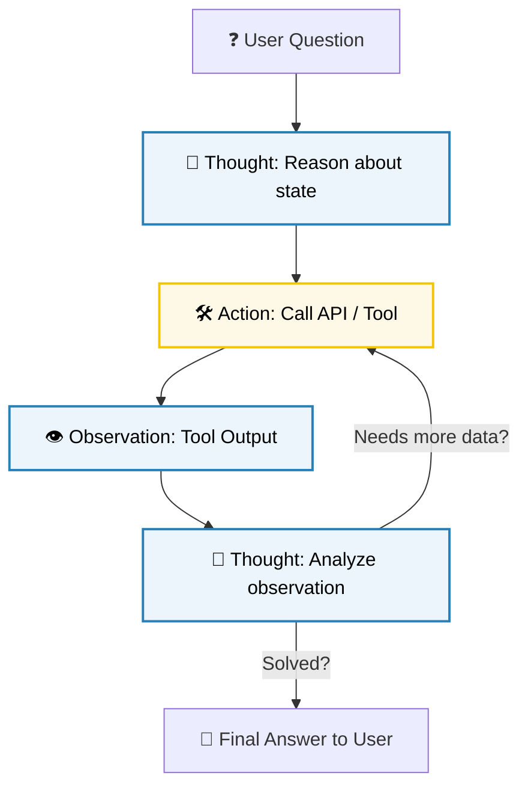

# ✍️ Prompt Engineering: Techniques, Templates & Design Patterns

Prompt engineering is the software engineering discipline of guiding Large Language Models (LLMs) to produce accurate, safe, and contextually grounded outputs. Because FMs operate on statistical token probability, the structure and style of your prompt directly dictates the mathematical weights that activate during inference.

---

## 1. 🚸 Zero-Shot vs. Few-Shot Prompting

The simplest way to guide a model is through the quantity of context examples provided inside the input prompt:

*   **Zero-Shot Prompting:** The model is presented with a task description and an input payload, with zero examples of expected input-output behavior. It must rely entirely on its pre-trained statistical associations.
    *   *Real-World Analogy:* Asking an experienced chef to cook a dish they have never prepared before, relying purely on the name of the dish and their general culinary knowledge.
    *   *Zero-Shot Example:*
        ```text
        Classify the sentiment of the following product review as Positive or Negative.
        Review: "The battery died after two hours of use."
        Sentiment:
        ```
> [!WARNING]
> **Zero-Shot Gotcha:** Zero-shot prompting is highly susceptible to formatting drift and hallucination when dealing with complex, multi-faceted constraints. If the model must output rigid JSON, zero-shot prompts frequently return conversational filler (e.g., "Sure, here is the classification: Positive") which crashes automated parser APIs.
*   **Few-Shot Prompting:** The model is provided with a task description and a small set of structured, in-context examples showing inputs paired with correct outputs.
    *   *Real-World Analogy:* Handing a line cook a recipe card along with three physical plates showing exactly how the finished dish must be plated and garnished before they start cooking.
    *   *Few-Shot Example:*
        ```text
        Classify the sentiment of the following product reviews as Positive or Negative.

        Review: "This camera takes beautiful pictures."
        Sentiment: Positive

        Review: "The zoom lens was loose and blurry."
        Sentiment: Negative

        Review: "The battery died after two hours of use."
        Sentiment:
        ```
> [!IMPORTANT]
> **Few-Shot Selection Bias:** This is a bit of a headache, but here is the trick: LLMs are highly sensitive to the order, distribution, and formatting of few-shot examples. If you supply three positive examples and only one negative example, the model's output distribution shifts towards positive classifications due to **recency bias** and **frequency bias**. You must keep few-shot examples balanced and randomly ordered.

---

## 2. 🧠 Chain-of-Thought (CoT) & Self-Consistency

For tasks requiring symbolic reasoning, mathematical logic, or multi-step analysis, standard prompting fails because the model attempts to predict the final answer token directly. **Chain-of-Thought (CoT)** fixes this by forcing the model to generate its reasoning process before outputting the final solution.

```
Standard Prompt ---> Input Question ------------> [LLM Matrix Math] ---> Wrong Answer
CoT Prompt      ---> Input + "Think step-by-step" -> Reason A -> B -> C -> Correct Answer
```

*   **Chain-of-Thought (CoT):** By appending instructions like *"Think step-by-step and show your reasoning before the final answer"*, we force the model to output intermediate mathematical or logical steps.
    *   *Mathematical Intuition:* In autoregressive LLMs, the probability of generating the correct next token $T_i$ is conditioned on all previous tokens:
```math
P(T_i \mid T_{i-1}, T_{i-2}, \dots, T_1)
```
        By writing out its intermediate reasoning steps, the model actively builds a logical context history. The final answer token is then conditioned on this correct logical history, raising prediction accuracy.
    *   *CoT Example:*
        ```text
        Question: A warehouse has 15 delivery trucks. 3 trucks are in the repair shop. 2 trucks are out on active routes. 4 new trucks are purchased. How many trucks are currently parked idle at the warehouse?
        
        Reasoning:
        1. Start with the total number of trucks: 15.
        2. Subtract the trucks in the repair shop: 15 - 3 = 12.
        3. Subtract the trucks out on active routes: 12 - 2 = 10.
        4. Add the newly purchased trucks to the fleet: 10 + 4 = 14.
        
        Answer: 14
        ```
*   **Self-Consistency:** An advanced extension of CoT. Instead of running a single deterministic inference run, we set the model's Temperature hyperparameter high (e.g., $0.7$) to generate a variety of diverse reasoning paths. We sample $M$ independent reasoning paths, extract the final numerical or categorical answer from each path, and select the final answer using a majority vote:
```math
\text{Final Answer} = \text{argmax}_{A} \sum_{i=1}^M \mathbb{I}(A_i = A)
```
    where $\mathbb{I}$ is the indicator function evaluating to $1$ if the path's answer $A_i$ matches candidate answer $A$, and $0$ otherwise.
    *   *Self-Consistency Example:* Generating 5 different Chain-of-Thought runs for a math puzzle. Run 1 yields `14`, Run 2 yields `12`, Run 3 yields `14`, Run 4 yields `14`, and Run 5 yields `14`. The self-consistency algorithm registers a $4/5$ majority vote for `14`, successfully filtering out the reasoning error in Run 2.

---

## 3. 🤖 The ReAct (Reasoning and Acting) Pattern

Modern generative AI applications do not just output text; they interact with databases, web servers, and third-party APIs. The **ReAct** pattern combines reasoning tracing (generating plans) with tool execution (acting) in an iterative, closed loop. This framework forms the core operational logic of **Amazon Bedrock Agents**.



The agent iterates through a strict loop:
1.  **Thought:** The model analyzes the current query and formulates a plan of action.
2.  **Action:** The model outputs a structured tool invocation request containing target API parameters.
3.  **Observation:** The system executes the API call (e.g., runs a database query) and feeds the raw results back to the model as context.
4.  **Loop:** The model evaluates the observation. If it has sufficient information, it generates the final answer; if not, it continues the loop with another thought-action cycle.

*   *ReAct Example (Bedrock Agent execution):*
    ```text
    User: "Find the customer record for user ID 4082 and check if they have paid their invoice."

    Thought: I need to retrieve the user profile for customer 4082 first to get their email and transaction history. I will call the GetCustomerProfile tool.
    Action: GetCustomerProfile(customer_id=4082)
    Observation: {"customer_id": 4082, "name": "Alice Smith", "email": "alice@example.com"}

    Thought: I have the customer profile. Now I need to check the payment status of their invoices. I will call the GetInvoices tool for customer 4082.
    Action: GetInvoices(customer_id=4082)
    Observation: [{"invoice_id": 9901, "amount": 250.00, "status": "Paid"}, {"invoice_id": 9982, "amount": 120.00, "status": "Unpaid"}]

    Thought: I see customer 4082 has one paid invoice (9901) and one unpaid invoice (9982). I have sufficient information to answer the user.
    Final Answer: Customer Alice Smith (User ID 4082) has an unpaid invoice of \$120.00 (Invoice ID 9982), while their previous invoice of \$250.00 (Invoice ID 9901) is marked as Paid.
    ```

---

## 4. 🗃️ Structural Isolation: Using XML & System Prompts

When deploying models in production, you must isolate the instructions written by developers from the untrusted data inputs submitted by users. If these boundaries are blurry, the model can confuse inputs with instructions, leading to prompt injection attacks.

*   **System Prompts:** The immutable foundation layer of the prompt. It defines the model's persona, operational rules, API tool definitions, and safety boundaries. System prompts are injected at a system-level configuration boundary, making them separate from the user message payload.
*   **XML Delimiters:** Standardizing the use of XML tags (e.g., `<context>`, `<rules>`, `<user_input>`) is highly recommended by top model developers (including Anthropic). Transformers are pre-trained on structured web documents, making them highly proficient at isolating text blocks wrapped in tags.
*   *Structured Delimiter Example:*
    ```text
    [System Prompt]
    You are an automated support assistant for Amazon Web Services. You must answer customer questions using ONLY the text provided inside the <kb_articles> tags. If the answer cannot be found in the text, respond with "I cannot answer this question."

    [User Prompt]
    <kb_articles>
    AWS PrivateLink establishes private connectivity between VPCs and AWS services without exposing traffic to the public internet.
    </kb_articles>

    <customer_query>
    How do I secure my Bedrock API traffic?
    </customer_query>
    ```

---

## 5. ⚡ Token Resource Dynamics & Prompt Design

When designing prompts, you must optimize for both token limits and sequence cost:

*   **Context Window Allocation:** Foundation models have fixed context windows (e.g., $200,000$ tokens for Claude 3). The context window is shared:
```math
\text{Context Size} = N_{\text{input}} + N_{\text{output}}
```
    If you bloat your input prompt with redundant context documents ($N_{\text{input}}$), you limit the remaining tokens available for generating the output response ($N_{\text{output}}$).
*   **The Attention Quadratic Complexity Gotcha:** The Transformer's self-attention mechanism computes similarity matrices across every single token in the input. The computational complexity and memory usage scale quadratically:
```math
\mathcal{O}(N^2)
```
    where $N = N_{\text{input}} + N_{\text{output}}$. Bloating your prompt with irrelevant filler words or massive, unpruned documents directly increases inference latency, endpoint execution timeouts, and billing costs.
*   **Prompt Pruning Strategies:**
    *   Strip out HTML formatting, conversational boilerplate, and redundant stop words from your retrieval contexts before injecting them into the prompt.
    *   Use sliding windows with minimal token overlaps to slice massive documents into concise, focused chunks.

---

## 6. 📊 Prompt Engineering Techniques Comparison

| Technique | Data Setup Required | Mathematical/Compute Overhead | Primary Benefit | Target Exam Use Case |
| :--- | :--- | :--- | :--- | :--- |
| **Zero-Shot** | None. | Low. | Instant deployment; zero data preparation. | Standard, low-risk categorization (e.g., classifying a feedback string as Bug vs Feature request). |
| **Few-Shot** | 3-5 high-quality examples. | Medium (increases input token counts). | Guides formatting consistency; limits semantic drift. | Outputting highly structured data payloads (e.g., transforming a transcript into strict JSON). |
| **Chain-of-Thought** | Instructions to explain reasoning. | Medium (increases output token counts). | Drastically improves logical and mathematical accuracy. | Solving multi-step logistical math or reasoning tasks. |
| **Self-Consistency** | High Temperature runs. | Very High (requires running $M$ parallel inferences). | Filters out random reasoning errors. | High-stakes mathematical, financial, or symbolic reasoning. |
| **ReAct Framework** | OpenAPI schemas and action tags. | High (requires multiple iterative thought-action rounds). | Links static LLMs to dynamic external environments. | Building autonomous serverless agents (Amazon Bedrock Agents). |
| **XML Isolation** | Structural tag formatting. | Low. | Prevents instruction confusion and mitigates prompt injections. | Securing enterprise RAG apps against malicious user payloads. |
