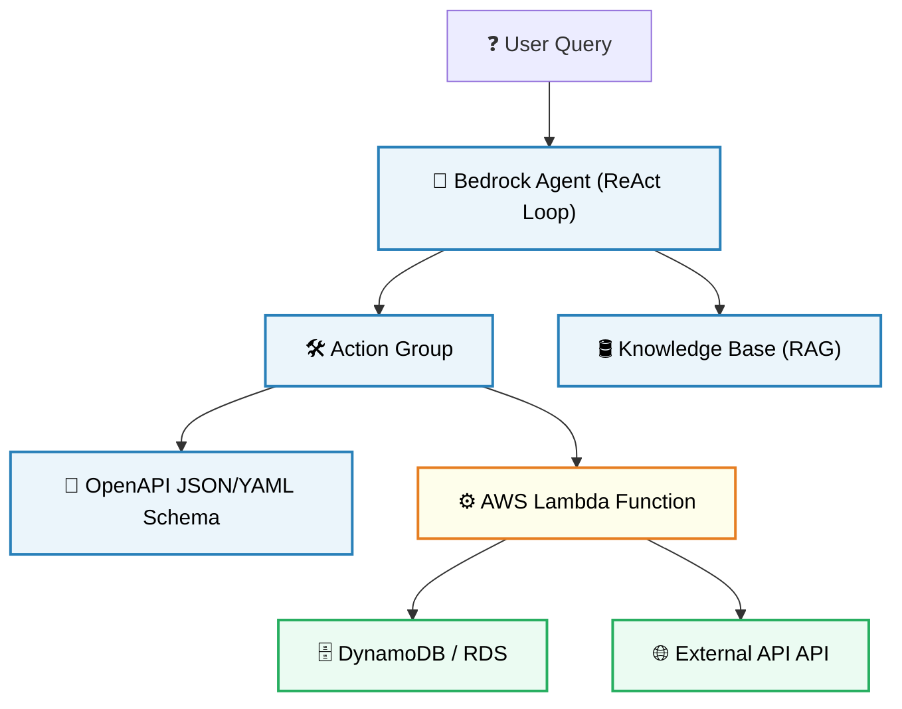

# 🧭 Advanced RAG & Agentic Architectures on AWS

Pre-trained foundation models contain general world knowledge, but they are static. They cannot access real-time records or query proprietary databases. To bridge this gap, developers implement **Retrieval-Augmented Generation (RAG)** and **Agentic Architectures** using Amazon Bedrock to connect models to external data systems.

---

## 1. The RAG Ingestion Pipeline: Chunking & Ingestion

RAG acts as an automated open-book exam helper. Before a model can read a document, the document must be processed, indexed, and stored in a vector database.

```
Raw Documents (S3) ---> [Document Chunking] ---> [Embedding Model] ---> [Vector Store (OpenSearch)]
                                                                               |
                                                                               v
User Prompt ----------> [Query Vectorizer] ----> [Vector Search (KNN)] --------+
                                                                               |
                                                                               v
LLM Context Window <--- [System Prompt + Query + Retrieved Chunks] <------------+
```

### A. Document Chunking Strategies
A massive document (e.g., a 500-page policy manual) cannot be embedded as a single vector because embeddings represent dense, localized semantic concepts. If you embed a huge document, its specific details get mathematically averaged out.
*   **Fixed-Size Chunking:** Splitting text into chunks based on a fixed character or token count, using a sliding window with a defined **overlap** to ensure concepts are not cut in half at chunk boundaries.
    *   *Gotcha:* If you set chunk size to 500 characters and overlap to 50, a crucial sentence (e.g., a price quote) that falls exactly at character 500 will be split across two chunks, destroying its semantic meaning.
*   **Semantic Chunking:** Analyzing text structure to split at natural grammatical boundaries (e.g., paragraphs, section headers, or shifts in sentence-to-sentence embedding similarity).
    *   *Trade-off:* Fixed-size chunking is computationally fast and simple, but semantic chunking preserves local document context much better, yielding cleaner vector search results.

### B. Embedding Generation
Once chunked, each text chunk is passed through an embedding model (e.g., **Amazon Titan Text Embeddings v2**) to output a high-dimensional vector:
```math
\vec{v} \in \mathbb{R}^d
```
where $d$ represents the vector dimensions (e.g., $1536$ or $3072$ dimensions). Words or sentences with similar semantic meaning are mapped to coordinates that sit close together in this vector space.

### C. Vector Store Selection on AWS
Bedrock Knowledge Bases automatically sync S3 documents and load vectors into one of these managed AWS endpoints:
*   **Amazon OpenSearch Serverless (Vector Engine):** Default, highly scalable serverless choice. Billed per OpenSearch Compute Unit (OCU) hour.
*   **Amazon Aurora (with pgvector):** Best if you want to store vector embeddings alongside traditional relational SQL databases.
*   **Amazon MemoryDB for Redis:** Best for ultra-low latency, in-memory vector lookups.
*   **MongoDB Atlas / Pinecone:** Third-party managed integrations.

---

## 2. The RAG Retrieval Pipeline: Vector Similarity

When a user submits a query, it is vectorized using the same embedding model. The vector database runs a **K-Nearest Neighbor (KNN)** search to find the chunks with the highest similarity:

### Vector Similarity Metrics
Vector databases calculate the closeness between the query vector $\vec{q}$ and document vectors $\vec{d}$ using these formulas:

*   **Cosine Similarity:** Measures the cosine of the angle between two vectors. It focuses purely on direction and is independent of vector magnitude:
    ```math
    \text{Cosine Similarity}(\vec{q}, \vec{d}) = \frac{\vec{q} \cdot \vec{d}}{\|\vec{q}\| \|\vec{d}\|} = \frac{\sum_{i=1}^d q_i d_i}{\sqrt{\sum_{i=1}^d q_i^2} \sqrt{\sum_{i=1}^d d_i^2}}
    ```
*   **Dot Product (Inner Product):** Computes the sum of products of coordinates. It measures both direction and magnitude (highly efficient if your vectors are normalized to unit length):
    ```math
    \vec{q} \cdot \vec{d} = \sum_{i=1}^d q_i d_i
    ```
*   **Euclidean Distance (L2 Distance):** Calculates the straight-line distance between two points in multi-dimensional space. A lower L2 score indicates higher similarity:
    ```math
    \|\vec{q} - \vec{d}\| = \sqrt{\sum_{i=1}^d (q_i - d_i)^2}
    ```

### Search Index Structures
Searching millions of vectors using exact calculations (flat index) is computationally slow. Databases build index structures to speed up retrieval:
*   **HNSW (Hierarchical Navigable Small World):** A multi-layer graph index that acts like a skip-list for vectors, allowing the search to skip vast regions of vector space and converge on the closest neighbors in milliseconds.
*   **IVF (Inverted File Index):** Clusters the vector space into voronoi cells. During retrieval, the query vector is compared only against the centroids of the closest cells, bypassing the rest of the database.

---

## 3. Agentic Orchestration: Amazon Bedrock Agents

While RAG is a passive data lookup pattern, **Bedrock Agents** are active, autonomous systems that use LLMs to execute multi-step workflows.



### Core Architecture Components:

1.  **ReAct Orchestration Loop:** The agent uses a ReAct prompt loop to alternate between reasoning traces ("thoughts") and tool executions ("actions").
2.  **Action Groups:** Define the actions the agent can perform. Each action group links:
    *   *An OpenAPI Schema:* A JSON or YAML document stored in S3 that defines the API endpoints, parameters, and input/output formats the agent can call.
    *   *An AWS Lambda Function:* The backend compute resource. When the agent decides to execute an action, it sends the parameters to the Lambda function. Lambda runs the code to query database structures, write records, or call third-party APIs.
3.  **Knowledge Bases (RAG):** The agent can query a vector database to retrieve contextual text chunks when it needs to answer questions about policy documents.
4.  **Session State & Memory:** To maintain context across a multi-turn conversation, Bedrock Agents use an automated session ID mapped to **Amazon DynamoDB** to store previous user prompts and model responses.

---

## 4. 📊 Customization Strategy: RAG vs. Fine-Tuning

Deciding whether to implement RAG or Fine-Tuning is a classic, heavily tested scenario on the AWS Certified AI Practitioner exam.

| Dimension | Retrieval-Augmented Generation (RAG) | Model Fine-Tuning |
| :--- | :--- | :--- |
| **Mathematical Goal** | Injects relevant factual context into the model's prompt in real-time. | Directly modifies the internal weight parameters of the neural network. |
| **Data Requirements** | Unlabeled text documents (PDFs, Wikis) stored in S3. | High-quality, labeled task-specific datasets (input-output pairs). |
| **Dynamic Updates** | **Instant.** If a policy document changes, update S3 and sync the vector store. | **Slow.** Requires preparing data and running a new compute training job. |
| **Factual Accuracy** | **High.** Model cites retrieved documents, drastically reducing hallucinations. | **Medium.** Model relies on parameter memory, meaning it can still hallucinate details. |
| **Tone & Style Control** | **Low.** Prompt templates can guide style, but the base model behavior is unmodified. | **High.** Alters the model's behavioral tone, formatting style, and syntax. |
| **Access Control** | **Easy.** Enforce row-level security in Lake Formation or vector store boundaries. | **Impossible.** You cannot easily block fine-tuned parameters from activating based on user roles. |
| **Target Exam Use Case** | Building a customer support bot to answer questions about changing product prices. | Fine-tuning a model to output medical codes in a strict, specialized billing format. |
