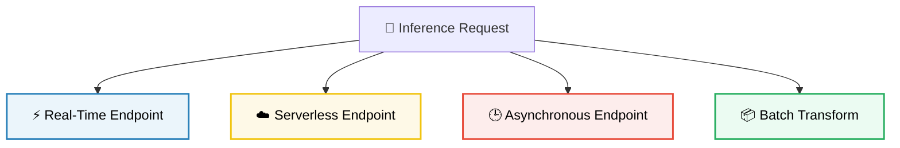

# ⚡ High-Performance Compute, Storage & Model Deployment

Deploying production-grade machine learning pipelines on AWS requires selecting the correct accelerated compute accelerators, configuring high-performance storage architectures to prevent data-read bottlenecks, and choosing the most cost-effective SageMaker deployment endpoints.

---

## 1. ⚡ Accelerated Compute: AWS Silicon vs. NVIDIA GPUs

Deep learning training and inference require specialized hardware designed for high-throughput matrix multiplication. AWS categorizes its hardware options across two primary families: AWS Custom Silicon and NVIDIA GPU instances.

### A. AWS Custom Silicon (Trainium & Inferentia)
To bypass GPU supply shortages and lower compute costs, AWS designs its own application-specific integrated circuits (ASICs) optimized for deep learning:
*   **AWS Trainium (Trn1 / Trn1e instances):** Custom AWS chips designed specifically for deep learning model training.
    *   *Exam Utility:* Choose Trainium for cost-efficient, high-performance distributed training of large language models, computer vision networks, and foundation models.
*   **AWS Inferentia (Inf2 instances):** Custom AWS chips designed for low-latency, high-throughput model inference.
    *   *Exam Utility:* Choose Inferentia to deploy production LLM endpoints, text-to-speech engines, or image generators where low inference latency and high token throughput are required at lower billing rates.

### B. NVIDIA GPU Instances
NVIDIA GPU instances remain the industry standard for general-purpose deep learning workloads:
*   `ml.g4dn` (NVIDIA T4 GPUs, $16\text{ GB}$ VRAM): The most cost-effective GPU instance family. Designed for light ML model training, model fine-tuning, and standard real-time inference workloads.
*   `ml.g5` (NVIDIA A10G GPUs, $24\text{ GB}$ VRAM): The industry workhorse for medium-scale training, complex real-time model serving, and LLM fine-tuning tasks.
*   `ml.p4de.24xlarge` (8x NVIDIA A100 GPUs, $640\text{ GB}$ VRAM total): High-performance compute instances featuring high-speed NVLink GPU interconnects. Essential for training foundation models from scratch and running massive, multi-node distributed training clusters.

---

## 2. 🗄️ High-Performance Storage for ML Pipelines

A common pitfall in deep learning training is the **GPU Starvation Problem**. If your storage layer cannot stream training data fast enough to keep up with the GPU's processing capabilities, the GPU sits idle (starving), wasting expensive compute time.

```
[ Amazon S3 ] --- Slow Read Stream ---> [ GPU Compute Node ] (Starving / Idle)
[ FSx for Lustre ] --- Parallel Fast ---> [ GPU Compute Node ] (100% Active)
```

To prevent this, you must select the right storage configuration:

*   **Amazon S3 (Simple Storage Service):** The default object storage system for machine learning. S3 acts as the primary data lake repository where raw datasets, model checkpoints, and final model output archives (`model.tar.gz`) are stored.
    *   *Mechanism:* SageMaker training jobs pull data from S3 using two data input modes:
        1.  *File Mode (Default):* Downloads the entire dataset from S3 to the training instance's local EBS volume before training begins.
> [!WARNING]
> **File Mode Startup Penalty:** If your dataset is huge (e.g., $1\text{ TB}$ of data), your training instance will sit idle for hours downloading files before running the first epoch, generating substantial idle-compute costs.
        2.  *Fast File Mode:* Streams data directly from S3 to the training script as a virtual local directory mount. This eliminates startup download times.
*   **Amazon EFS (Elastic File System):** A fully managed, elastic network file system. EFS allows you to mount a shared directory across multiple notebooks, developer workspaces, or training nodes, allowing developers to share code libraries and config files.
*   **Amazon FSx for Lustre:** A high-performance, parallel file system designed for compute-heavy workloads. FSx for Lustre mirrors your S3 bucket, caching active files and serving them with sub-millisecond latencies and millions of IOPS.
    *   *Exam Utility:* **FSx for Lustre is the gold standard for large-scale training jobs.** If your dataset consists of millions of small files (e.g., image grids or text snippets) and you are running training on a multi-node GPU cluster, use FSx for Lustre to eliminate S3 transfer bottlenecks and prevent GPU starvation.

---

## 3. 🎯 SageMaker Endpoint Deployment Strategies

Once your model is trained, SageMaker supports four distinct deployment patterns to serve inference. Selecting the right endpoint is a major theme on the AIF-C01 exam:



### A. Real-Time Inference
A continuous, low-latency HTTP endpoint hosted on dedicated, always-on compute instances.
*   *Pricing:* Billed per hour for the running instance, regardless of active traffic volume.
*   *Primary Use Case:* Customer-facing web applications requiring instant, sub-second model responses (e.g., real-time credit card fraud detection).

### B. Serverless Inference
A serverless endpoint that automatically scales compute capacity in response to traffic, scaling down to **zero** when idle.
*   *Pricing:* Pay-per-use, billed per millisecond of active execution time and data payload size. No costs when idle.
*   *Primary Use Case:* Applications with highly intermittent, unpredictable, or bursty traffic patterns (e.g., an internal HR chatbot used sporadically during the day).
> [!WARNING]
> **Cold-Start Latency:** If the endpoint has been idle and scales down to zero, the first incoming request will experience a "cold start" (latency delay of several seconds) while SageMaker provisions a new container backend. Avoid Serverless Inference if sub-second latency is a strict SLA.

### C. Asynchronous Inference
An endpoint designed for heavy payloads or long processing times. Incoming requests are queued in an Amazon SQS queue, processed asynchronously, and the final predictions are written to an S3 bucket.
*   *Pricing:* Billed per hour for running instances, but you can configure auto-scaling rules to scale down to zero when the SQS queue is completely empty (helping control costs).
*   *Primary Use Case:* Large input payloads (up to 1GB) and processing jobs that take minutes or hours (e.g., transcribing a 3-hour audio call or running video segmentation).

### D. Batch Transform
A serverless offline scoring job. SageMaker spins up a compute cluster, pulls a massive static dataset from S3, runs predictions over the files in batch, writes the output files back to S3, and immediately terminates the compute cluster.
*   *Pricing:* Billed only for the exact duration of the batch run. No persistent endpoints or active instances are maintained.
*   *Primary Use Case:* Weekly or nightly bulk predictions on historical data where real-time APIs are not required (e.g., running weekly customer churn scores on a database of 10 million users).

---

## 4. 📊 SageMaker Deployment Endpoints Comparison

| Endpoint Pattern | Scalability & Idle State | Maximum Payload Limit | Pricing Metric | Primary Exam Scenario |
| :--- | :--- | :--- | :--- | :--- |
| **Real-Time** | Dynamic scaling; never scales to zero (always-on). | $6\text{ MB}$ | Continuous hourly instance rate. | Continuous, sub-second customer predictions (e.g., fraud checkout). |
| **Serverless** | Automatically scales down to **zero** when idle. | $30\text{ MB}$ | Active execution milliseconds + data payload. | Highly intermittent, bursty traffic where you want zero idle billing (accepts cold starts). |
| **Asynchronous** | Queue-based; can scale down to **zero** when queue is empty. | $1\text{ GB}$ | Active instance hour rates. | Processing heavy files (e.g., video clips or PDF blocks) taking minutes to score. |
| **Batch Transform** | Serverless; compute is terminated immediately after run. | Unlimited (streams S3 blocks). | Compute execution time during the run. | Running bulk predictions on historical datasets weekly or nightly. |
