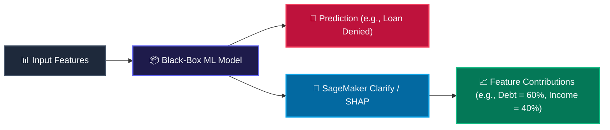

# ⚖️ Responsible AI, Bias Detection & Model Governance

Building reliable machine learning systems requires strict adherence to ethical, legal, and safety standards. AWS structures this discipline under the **Six Dimensions of Responsible AI** and integrates automated detection tools (SageMaker Clarify) to monitor bias and explain predictions.

---

## 1. 🏛️ The Six Dimensions of Responsible AI

AWS defines a structured framework to govern the deployment of artificial intelligence:

1.  **Fairness:** Ensuring models make predictions free from demographic bias or systematic discrimination based on protected attributes (e.g., race, gender, age).
2.  **Explainability:** Providing human-understandable explanations for how models arrive at their output decisions, ensuring accountability.
3.  **Robustness:** Ensuring the model maintains consistent performance and handles corrupted inputs, system noise, or malicious adversarial attacks safely.
4.  **Privacy & Security:** Safeguarding sensitive dataset assets, ensuring encryption at rest and in transit, and restricting model data exposure.
5.  **Safety:** Controlling generative outputs to prevent the generation of harmful, toxic, illegal, or sexually explicit content.
6.  **Governance:** Establishing organizational control, auditing pipelines, maintaining metadata logs, and complying with international standards (such as ISO/IEC 42001).

---

## 2. 🔀 Classification of Machine Learning Bias

Bias can infect a machine learning pipeline at multiple stages of the lifecycle:

*   **Historical Bias:** Arises when the training data reflects pre-existing societal prejudices, inequalities, or systemic discrimination.  <br /> 🔍 **Example:** Training a hiring model on 30 years of corporate recruitment history where women were systematically excluded from executive leadership roles.
*   **Sampling Bias (Selection Bias):** Occurs when the collected dataset does not accurately represent the true population distribution, leaving entire demographic subgroups underrepresented.  <br /> 🔍 **Example:** Training an autonomous vehicle pedestrian classifier on images collected purely during bright, sunny daylight hours, making it highly error-prone at night.
*   **Label Bias:** Arises when target labels are applied inconsistently or are influenced by subjective human judgment during data annotating.  <br /> 🔍 **Example:** A medical diagnostic system where doctors apply positive cancer labels to low-income patients at a different rate due to subjective diagnostic criteria.
*   **Measurement Bias:** Occurs when the sensors, logging devices, or feature collection tools introduce systematic measurement errors.  <br /> 🔍 **Example:** A credit evaluation model that mixes values from three different credit bureaus that calculate debt ratios using different formulas.

---

## 3. 📊 SageMaker Clarify: Pre-Training & Post-Training Bias Metrics

To detect bias mathematically, **Amazon SageMaker Clarify** analyzes datasets before training (pre-training) and evaluates model predictions after training (post-training).

Let $D$ represent our training dataset containing a demographic facet $A$. Let $A = a$ represent the favored demographic facet (e.g., higher-income applicants) and $A = d$ represent the disfavored demographic facet (e.g., lower-income applicants). SageMaker Clarify computes these core metrics:

### A. Class Imbalance (CI)
CI measures the raw distribution inequality of data rows between the favored and disfavored facets in the dataset. It ranges from $-1.0$ to $+1.0$:
```math
CI = \frac{n_a - n_d}{n_a + n_d}
```
where $n_a$ is the number of rows belonging to the favored facet $a$, and $n_d$ is the number of rows belonging to the disfavored facet $d$.
*   *Interpretation:* A CI value close to $+1.0$ indicates that the favored group dominates the dataset, meaning the model will have insufficient data to learn representations of the disfavored group (high risk of sampling bias).

### B. Difference in Proportions of Labels (DPL)
DPL calculates the difference in positive outcomes received by the favored and disfavored groups. It ranges from $-1.0$ to $+1.0$:
```math
DPL = q_a - q_d
```
where $q_a$ is the proportion of positive labels in the favored facet $a$, and $q_d$ is the proportion of positive labels in the disfavored facet $d$:
```math
q_a = \frac{n_{a}^{+}}{n_a} \quad \text{and} \quad q_d = \frac{n_{d}^{+}}{n_d}
```
where $n_{a}^{+}$ and $n_{d}^{+}$ are the number of rows in each facet that received a positive target classification.
*   *Interpretation:* A high DPL (e.g., $DPL = 0.40$) indicates a structural outcome disparity between the groups, showing that the favored group receives positive labels at a much higher rate.

### C. Conditional Demographic Disparity (CDD)
CDD controls for confounding variables to prevent misleading conclusions caused by **Simpson's Paradox** (where an apparent bias disappears or reverses when the data is split into subgroups).
Let the dataset be partitioned into $k$ distinct, homogeneous subgroups (e.g., splitting applicants by job type). CDD calculates disparity within each subgroup $i$ and averages them:
```math
CDD = \sum_{i=1}^k \frac{N_i}{N} \left( d_a^i - d_d^i \right)
```
where $N_i$ is the number of rows in subgroup $i$, $N$ is the total dataset size, and $d_a^i$ and $d_d^i$ represent the demographic disparities within that specific subgroup.
*   *Interpretation:* CDD ensures you are comparing similar profiles (e.g., comparing junior developers against junior developers) rather than drawing false conclusions from aggregated data.

---

## 4. 🔮 Model Explainability & Feature Attribution

To trust a model's output, engineers must understand *why* it arrived at a prediction. AWS supports two primary mathematical frameworks for explainability:



### A. SHAP (Shapley Additive exPlanations)
SHAP is a game-theoretic framework that distributes the predictive "payoff" among the input features. It calculates the marginal contribution of each feature across all possible feature combinations.

*This is a bit of a headache, but here is the trick:* To compute the exact contribution of feature $i$, the SHAP algorithm evaluates the model's output across every possible subset (sub-coalition) of features. It computes the change in prediction when feature $i$ is added to a subset versus when it is omitted, weighting and averaging these values across all combinations:
```math
\phi_i(v) = \sum_{S \subseteq N \setminus \{i\}} \frac{|S|!(|N| - |S| - 1)!}{|N|!} \left( v(S \cup \{i\}) - v(S) \right)
```
where $N$ is the complete set of features, $S$ is a subset of features excluding feature $i$, and $v(S)$ represents the model's prediction using only features in $S$.  <br /> 🔍 **Example:** A bank's model denies a credit application. SageMaker Clarify runs a SHAP analysis and outputs Shapley values: `Debt-to-Income Ratio = +0.35`, `Missed Payments = +0.20`, and `Annual Income = -0.15`. The bank can explain to the auditor that the high debt-to-income ratio was the primary feature that pushed the model's prediction past the denial threshold.

### B. LIME (Local Interpretable Model-agnostic Explanations)
LIME explains a highly complex, non-linear black-box model locally around a specific prediction.
*   *Mechanism:* LIME perturbs (tweak/varies) the features of a single input instance and records how the predictions change. It fits a simple, highly interpretable linear surrogate model (like a decision tree or linear regression) over this localized data neighborhood, extracting the feature slopes to explain that single prediction.

> [!WARNING]
> **SHAP vs LIME Explainability Gotcha:** SHAP uses game theory to calculate local feature attributions across all feature coalitions. LIME trains local surrogate linear models. SHAP is mathematically consistent but slow.

> [!WARNING]
> **Partial Dependence Plots (PDP) for Stakeholders:** When stakeholders require explainability on how a model makes predictions, include PDPs. They visualize the marginal effect of one or two features on the model's predicted outcome, making relationship trends (linear, quadratic) obvious.

---

## 5. 📂 Model Governance Lifecycle on AWS

AWS provides specialized services to track, catalog, audit, and monitor models across their lifecycle:

*   **SageMaker Model Cards:** Act as the system of record for model documentation. They capture metadata including:
    *   *Design Specifications:* Intended use cases, training configurations, and algorithm types.
    *   *Data Provenance:* Training datasets, validation splits, and S3 paths.
    *   *Performance Metrics:* Accuracy scores, precision/recall benchmarks, and SageMaker Clarify bias evaluation reports.
*   **SageMaker Model Registry:** A catalog to version-control models.

> [!WARNING]
> **Model Registry Gating Gotcha:** Registered models are locked and cannot be deployed by CI/CD pipelines until a compliance lead manually changes their approval state to `Approved`.

> [!WARNING]
> **SageMaker Model Monitor Drift Gotcha:** Model Monitor captures endpoint payloads to detect Data Quality, Concept, and Feature Attribution drift. Feature Attribution drift specifically uses SHAP values to detect if feature importances have shifted since training.

*   **SageMaker Model Monitor:** Captures real-time request and response payloads from active production endpoints to automatically detect three types of drift:
    1.  *Data Quality Drift:* Checks if the statistical distributions of incoming real-world features are shifting away from the training baseline (e.g., an sensor starts failing, sending zero values).
    2.  *Concept Drift:* Detects if the relationship between features and the target labels has changed (e.g., macroeconomic shifts change customer buying behaviors).
    3.  *Feature Attribution Drift:* Uses SHAP to monitor if the relative importance of features in real-world predictions has drifted from the training baseline.

---

## 6. 📊 SageMaker Clarify Pre-Training Bias Metrics Summary

| Metric | Formula | Range | Good Value | Key Gotcha |
| :--- | :--- | :--- | :--- | :--- |
| **Class Imbalance (CI)** | $\frac{n_a - n_d}{n_a + n_d}$ | $[-1, 1]$ | $0.0$ | Close to $1.0$ means your dataset is heavily dominated by one group, raising the risk of sampling bias. |
| **Difference in Proportions of Labels (DPL)** | $q_a - q_d$ | $[-1, 1]$ | $0.0$ | A high positive DPL means the favored group is getting positive outcomes at a significantly higher rate. |
| **Conditional Demographic Disparity (CDD)** | $\sum \frac{N_i}{N}(d_a^i - d_d^i)$ | $[-1, 1]$ | $0.0$ | CDD controls for subgroups, bypassing Simpson's Paradox where aggregated statistics mask or invert true bias. |
