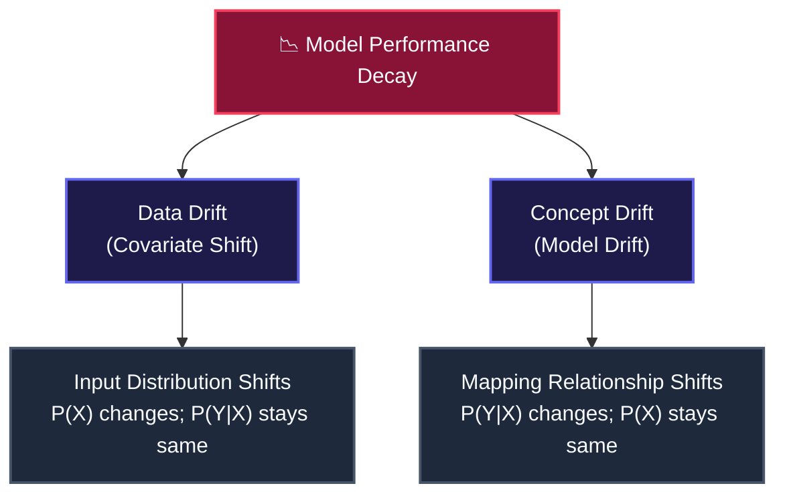

# 🛡️ AI Governance, Security Services & Model Drift

Deploying an AI model is not a "set-and-forget" project. In production, models are exposed to regulatory audits, data privacy risks, and statistical decay. The AWS Certified AI Practitioner exam tests your understanding of compliance logging, data discovery, feature management, and identifying when a model has degraded.

---

## 1. 📂 AWS Governance, Security & Compliance Services

To satisfy security and compliance requirements (Domain 5), you must know which non-ML AWS infrastructure services to use:

*   **Amazon Macie:** A data security service that uses machine learning and pattern matching to automatically discover, monitor, and protect sensitive data—specifically Personally Identifiable Information (PII) like SSNs, credit cards, or passport numbers—stored in **Amazon S3**.
> [!WARNING]
> **Macie Boundary Gotcha:** Amazon Macie *only* scans S3 buckets. It cannot directly monitor or scan databases (like DynamoDB or RDS) or block storage (EBS). To audit databases with Macie, you must export their contents to S3 first.

*   **AWS Audit Manager:** Automates evidence collection to evaluate compliance with industry standards (e.g., HIPAA, GDPR, SOC 2). It maps your active AWS configurations directly to compliance controls.
> [!WARNING]
> **Audit Manager Gotcha:** Audit Manager is a *reporting* and compliance-tracking tool, not an enforcement engine. It does not actively block threats, remediate vulnerabilities, or fix configuration issues.

*   **AWS Trusted Advisor:** Evaluates your entire AWS account configuration against AWS best practices across five pillars: Cost Optimization, Security, Fault Tolerance, Performance, and Service Limits.
> [!WARNING]
> **Trusted Advisor Gotcha:** Comprehensive and advanced checks are locked behind AWS Business or Enterprise support tiers. Basic accounts only get standard core checks.

*   **AWS Artifact:** Your self-service download portal for AWS security reports (e.g., SOC 1/2/3, PCI-DSS, ISO certifications) and signing global agreements (including the Business Associate Addendum / BAA for HIPAA compliance).
> [!WARNING]
> **Governance Separation Gotcha:** Audit Manager compiles evidence reports for compliance. Trusted Advisor checks configurations against five pillars (Cost, Security, Fault Tolerance, Performance, Limits). CloudTrail logs raw identity API calls.

---

## 2. 🧪 SageMaker Ecosystem: Data Prep, Features & Auditing

SageMaker provides dedicated subsystems to manage the ML pipeline lifecycle from raw data to deployed endpoints:

*   **SageMaker Data Wrangler:** A visual tool within SageMaker Studio to clean, analyze, and transform tabular and image datasets with over 300 built-in operations (e.g., balance classes, handle missing values) without writing code.
*   **SageMaker Feature Store:** A centralized repository to store, share, and version features (variables) across multiple data science teams.
    *   *Online Store:* Low-latency read access (milliseconds) designed for real-time inference workloads (usually backed by DynamoDB).
    *   *Offline Store:* High-latency batch access designed for training data generation and historical analysis (backed by Amazon S3).
> [!WARNING]
> **Feature Store Latency Gotcha:** The Online Store is designed for low-latency real-time inference (backed by DynamoDB), whereas the Offline Store is designed for high-latency batch training (backed by S3). Using S3 directly for real-time model requests will cause timeout failures.

*   **SageMaker Ground Truth Plus:** A turnkey data labeling service where AWS manages the labeling workforce, data quality checks, and workflow, unlike regular SageMaker Ground Truth where you must configure the software and manage the workforce yourself.
*   **SageMaker Model Cards:** Standardized documentation templates to record model metadata, training configurations, validation metrics, intended use cases, and audit history to provide model **transparency** to stakeholders.

---

## 3. 📉 Model Decay: Data Drift vs. Concept Drift

Once a model is in production, its performance will eventually degrade due to shifts in the real world. **SageMaker Model Monitor** tracks this degradation by detecting two distinct types of drift:

#### 1. Data Drift (Covariate Shift)
The statistical distribution of the input features ($X$) changes over time, but the underlying relationship between inputs and target labels ($P(Y \vert X)$) remains unchanged.
*   **Mathematical notation:**
    $$P(X_{\text{production}}) \neq P(X_{\text{training}})$$
*   **Exam Scenario:** A retail company deploys a transaction model on SageMaker trained on historical retail store purchases. Over a holiday season, customer shopping habits shift heavily toward high volumes of online e-commerce transactions. The statistical distribution of the input features $P(X)$ changes (e.g. `is_online_transaction` increases from $15\%$ to $70\%$), but the underlying relationship predicting fraud risk given online status remains mathematically consistent (Data Drift, aligning with Question 20 and Question 45 in our practice quiz). SageMaker Model Monitor flags this feature distribution shift.

#### 2. Concept Drift (Model Drift / Label Shift)
The statistical properties of the target variable ($Y$) or the mapping relationship between inputs and outputs ($P(Y \vert X)$) change. The same inputs now lead to completely different outputs.
*   **Mathematical notation:**
    $$P(Y \vert X_{\text{production}}) \neq P(Y \vert X_{\text{training}})$$
*   **Exam Scenario:** A financial lender trains a credit card default prediction model. A sudden regulatory policy changes the legal definition of default, or an economic recession causes default rates to spike across all credit scores. The input features ($X$, e.g. credit score, debt ratio) remain identical, but the actual probability of default given those features $P(Y \vert X)$ shifts dramatically, making the model's historical mapping obsolete (Concept Drift, aligning with Question 17 and Question 45 in our practice quiz). SageMaker Model Monitor flags this relationship decay.

---

## 4. 🪨 Bedrock Customization Capacity & Parameters

When customizing foundation models in Bedrock, there are strict cost and operational gotchas to consider:

*   **Provisioned Throughput Requirement:** If you create a custom model in Bedrock via fine-tuning (supervised learning using prompt-completion JSONL pairs) or continued pre-training, you **cannot** run inference on it using pay-as-you-go On-Demand pricing.
> [!WARNING]
> **Bedrock Custom Model Cost Trap:** Deploying custom fine-tuned or pre-trained Bedrock models requires purchasing committed Model Units (Provisioned Throughput). You cannot host custom models on-demand.

*   **Bedrock Guardrails:** Implementing safety layers that check inputs and outputs for filtering toxic content, denied topics, or redacting sensitive data.
> [!WARNING]
> **Bedrock Guardrails PII Masking Gotcha:** To prevent exposing confidential details, configure Bedrock Guardrails to redact or mask PII (Social Security Numbers, email addresses, phone numbers) before inputs reach the model or before responses return to users.

*   **PartyRock:** An Amazon Bedrock-powered no-code playground that allows users to visually build generative AI applications using drag-and-drop widgets.

---

## 5. 📊 Service Choice Cheat Sheet

| Requirement | primary AWS Service | Key API / Configuration |
| :--- | :--- | :--- |
| **Audit S3 for exposed PII data** | **Amazon Macie** | Automated S3 scanning jobs. |
| **Sign HIPAA BAA Agreements** | **AWS Artifact** | Artifact Agreements console. |
| **Gather proof of HIPAA compliance** | **AWS Audit Manager** | Automatic evidence report collection. |
| **Review EC2 cost/security limits** | **AWS Trusted Advisor** | Service limits dashboard checks. |
| **Detect real-time credit card fraud features** | **SageMaker Feature Store** | Online Store (millisecond read latency). |
| **Store historical training features** | **SageMaker Feature Store** | Offline Store (backed by Amazon S3). |
| **Identify shift in transaction patterns** | **SageMaker Model Monitor** | Data Drift metrics. |
| **Outsource labeling workforce management** | **SageMaker Ground Truth Plus** | Managed annotation workforce. |
| **Deploy custom fine-tuned Bedrock model** | **Amazon Bedrock** | Provisioned Throughput commitment. |
| **Redact SSNs from chatbot outputs** | **Amazon Bedrock** | Guardrails with PII Masking. |
| **Visually build a GenAI prototype** | **PartyRock** | PartyRock widgets playground. |
