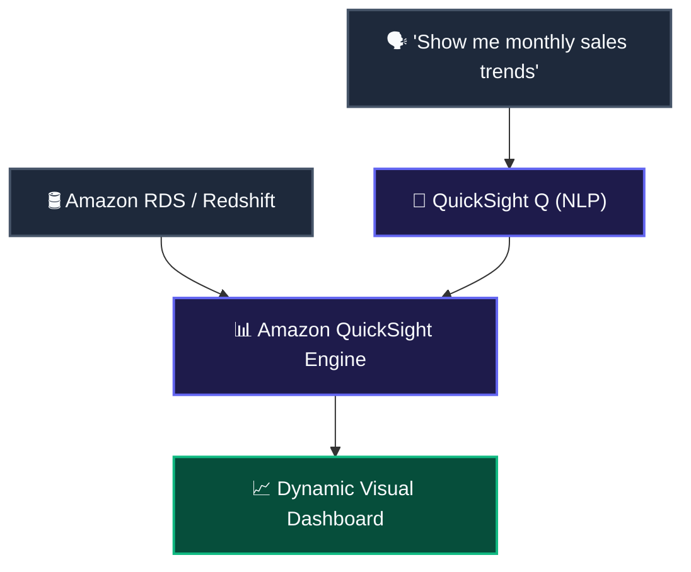

# 📊 Advanced Analytics, Security, Governance & Financial Management

To build robust, production-ready AI systems on AWS, you cannot just rely on model weights and prompt design. You have to handle the data lakes, big-data pipelines, enterprise security boundaries, and financial controls that keep your business compliant and solvent. 

Let us deconstruct the final set of in-scope AWS services and architectural patterns you need to master for the AIF-C01 exam.

---

## 1. 📈 Business Intelligence: Amazon QuickSight & QuickSight Q

Building a high-performing model is useless if business executives cannot read its findings. **Amazon QuickSight** is a serverless, cloud-scale Business Intelligence (BI) service that lets you create interactive dashboards and visualize machine learning outputs.

*   **Generative BI (QuickSight Q):** Instead of waiting for a data engineer to write a SQL query and build a chart, business users type natural language questions (e.g., *"What were our top-selling products in California last quarter?"*). QuickSight Q uses an underlying machine learning semantic parser to understand the intent, query the data source, and render a dynamic chart instantly.
*   **ML Insights:** QuickSight features built-in ML algorithms that run one-click anomaly detection, forecasting, and natural language narrative summaries directly on your datasets.

> [!TIP]
> **Exam Scenario:** A business analyst at a retail company needs to analyze regional sales performance but has minimal technical experience with SQL databases. By deploying **Amazon QuickSight Q**, the analyst types *"What were our top-selling products in California last quarter?"* in plain English. The underlying ML semantic engine translates the query, reads the database backend, and generates the visual report instantly.

> [!WARNING]
> **QuickSight Q Scope Gotcha:** Do not confuse QuickSight Q with a general-purpose LLM like Amazon Bedrock. QuickSight Q cannot draft marketing copy, write application code, or process raw text databases. It is strictly optimized to map natural language queries to structured schemas (like Redshift, Athena, or RDS) and generate visual reports.

---

## 2. 🚰 Big Data Preprocessing & Sourcing: Amazon EMR & AWS Data Exchange

Before you can feed high-quality tokens into a foundation model, you must process raw, noisy enterprise datasets at scale.

*   **Amazon EMR (Elastic MapReduce):** EMR is a managed cluster platform that simplifies running open-source big data frameworks—such as **Apache Spark**, **Hive**, and **Presto**—on AWS. It allows you to spin up clusters of EC2 instances to run distributed preprocessing, feature engineering, and data transformations across petabyte-scale datasets.
*   **AWS Data Exchange:** Training modern models requires massive external datasets. AWS Data Exchange lets you find, subscribe to, and consume third-party data from trusted providers directly in the cloud. You can instantly import financial market feeds, medical research records, or weather data into your Amazon S3 data lakes.

> [!TIP]
> **Exam Scenario:** A media company is processing a 100 TB data lake of unstructured video logs to prepare training features. The engineering team launches an **Amazon EMR** cluster to run distributed Apache Spark jobs. For other visual, no-code data preparation on tabular marketing statistics, the marketing analysts use **AWS Glue DataBrew** visual recipes, and subscribe to third-party audience demographic datasets via **AWS Data Exchange** to enrich their data lake.

> [!WARNING]
> **EMR Cost Gotcha:** EMR clusters run on standard EC2 instances that you configure and manage. If you forget to enable **Auto-Scaling** or neglect to configure **Auto-Termination** policies, the cluster instances will run indefinitely in the background, generating massive compute bills even when idle.

---

## 3. 🛡️ Enterprise Security & Vulnerability Auditing

To deploy models safely in enterprise environments, you must safeguard your keys and continuously audit your host platforms.

### A. AWS Secrets Manager
Security compliance demands that you never hardcode database credentials, API tokens, or model license keys inside your application source code or SageMaker Jupyter notebooks. **AWS Secrets Manager** lets you securely encrypt, store, and automatically rotate credentials. Your applications fetch these secrets programmatically at runtime using secure API endpoints.

### B. Amazon Inspector
Host infrastructure is a primary attack vector. **Amazon Inspector** is an automated vulnerability management service that continuously scans AWS workloads for software vulnerabilities, exposed packages, and unintended network exposure. It automatically audits your:
1.  **Amazon EC2 Instances:** Scans the underlying operating system packages for known CVEs.
2.  **Amazon ECR (Container Registry):** Scans docker container images hosting your custom PyTorch or TensorFlow inference engines before they are pushed to ECS or EKS.
3.  **AWS Lambda Functions:** Analyzes serverless function code for software vulnerabilities.

> [!IMPORTANT]
> **Inspector Boundary Gotcha:** Amazon Inspector is a security scanner for *infrastructure packages, operating systems, and network paths*. It cannot identify algorithmic bias in your machine learning models, detect prompt injection attacks, or check for training dataset contamination. For model-specific bias and explainability, you must use **SageMaker Clarify**.

---

## 4. 🏛️ Architecture Review: The AWS Well-Architected Tool (AI/ML Lens)

Building AI systems is a balancing act between accuracy, latency, and cost. The **AWS Well-Architected Tool** helps you review the state of your cloud workloads and compare them to official AWS architectural best practices.

*   **The AI/ML Lens:** A dedicated framework within the tool that guides you through designing and operating machine learning workloads on AWS. It evaluates your architecture across six pillars:
    1.  **Operational Excellence:** Automated pipelines, model versioning, and continuous integration.
    2.  **Security:** IAM boundaries, data encryption, and model lineage protection.
    3.  **Reliability:** Multi-AZ endpoints, auto-scaling inference, and model fallback mechanics.
    4.  **Performance Efficiency:** Matching instance types (e.g., AWS Inferentia vs. NVIDIA GPUs) to your workload demands.
    5.  **Cost Optimization:** Spot instances for training, serverless endpoints for irregular traffic, and model pruning.
    6.  **Sustainability:** Minimizing carbon footprint by selecting energy-efficient custom hardware (like AWS Trainium).

---

## 5. 💰 Cloud Financial Management: AWS Budgets & Cost Explorer

Deploying large language models or running distributed training jobs on GPU clusters is computationally intense and expensive. You must implement financial guardrails.

*   **AWS Cost Explorer:** A visual tool that lets you view, analyze, and forecast your historical AWS costs and usage. You can filter costs by service (e.g., Amazon Bedrock, SageMaker), instance type, or custom tags to identify cost drivers.
*   **AWS Budgets:** Lets you set custom cost and usage limits. You can configure alerts to notify you via email or SNS when your actual or forecasted costs cross a defined threshold.

### Formal Budgeting & Token Cost Calculations
When hosting foundation models or running batch inference on Amazon Bedrock, billing is determined by token consumption rather than standard server uptime. The total cost of an inference workload is calculated formally as:

$$Cost_{Total} = \left( N_{input} \times R_{input} \right) + \left( N_{output} \times R_{output} \right)$$

where:
*   $N_{input}$ is the number of input (prompt) tokens processed.
*   $R_{input}$ is the rate charged per input token.
*   $N_{output}$ is the number of output (generated) tokens processed.
*   $R_{output}$ is the rate charged per output token.

> [!WARNING]
> **AWS Budgets Enforcement Gotcha:** Under the hood, AWS Budgets is an *alerting* system, not an active enforcement gatekeeper. If a junior developer launches a massive hyperparameter tuning job that breaches your daily cost budget, AWS Budgets will send an email alert, but it will **not** automatically terminate the running GPU instances. To actively kill a run upon budget breach, you must link the budget alert to an **AWS Lambda** function via Amazon SNS to execute the termination APIs programmatically.

---

## 6. 📊 Enterprise Service Selection Matrix

Use this cheat sheet to select the correct governance, security, or data pipeline service on the exam:

| Business Goal | Recommended AWS Service | Key Metric / Feature |
| :--- | :--- | :--- |
| **Visualize model outputs via NLP Q&A** | **Amazon QuickSight Q** | Natural Language to SQL semantic parser. |
| **Clean petabyte-scale raw log data** | **Amazon EMR** | Managed Apache Spark / Hadoop clusters. |
| **Safeguard API keys and model credentials** | **AWS Secrets Manager** | Programmatic secret retrieval and rotation. |
| **Scan Docker container images for CVEs** | **Amazon Inspector** | Automated ECR container vulnerability scanning. |
| **Compare AI workload against best practices** | **AWS Well-Architected Tool** | The AI/ML Architectural Lens. |
| **Prevent unexpected billing spikes on Bedrock** | **AWS Budgets** | SNS threshold alert notifications. |
| **Acquire pre-packaged third-party training data** | **AWS Data Exchange** | Managed data subscription catalog. |
